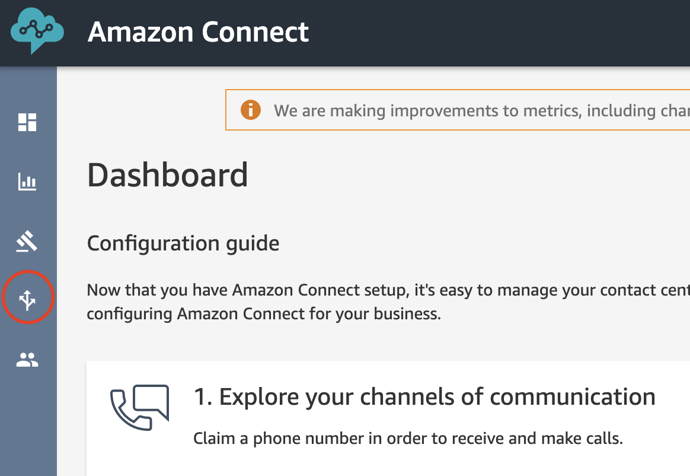
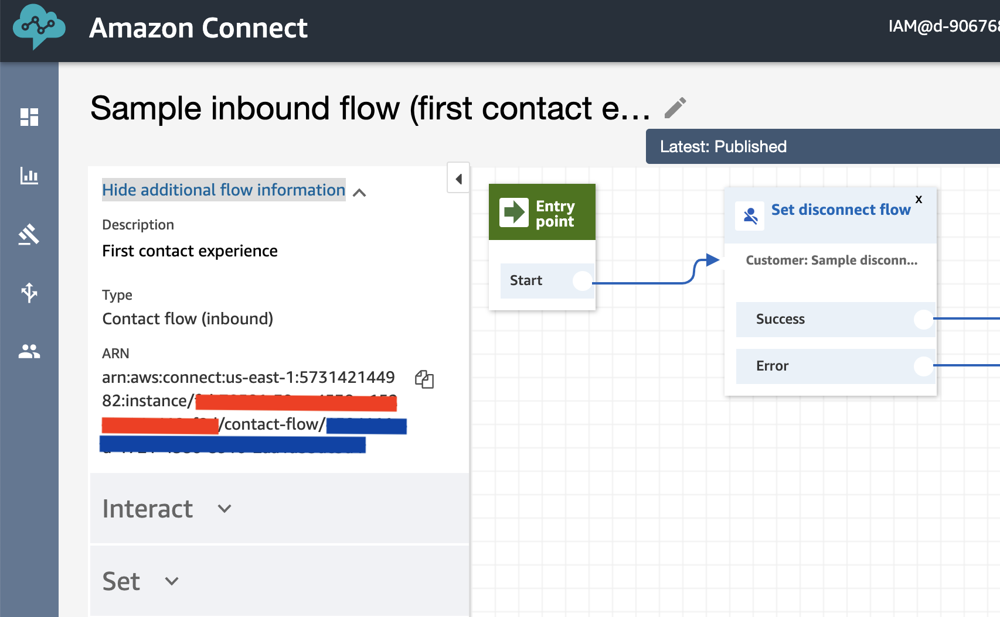

# Transfer to Amazon Connect Live Chat

This feature allows users of the Lex Web UI to have conversations with an Amazon Connect Live Agent. When the user
requests a transfer, all subsequent messages are sent to Connect Live Chat Agent and responses from the Agent are 
displayed back to the user as a message bubble. The conversation continues between user and agent until
either party disconnects. Once disconnected, messages are again sent to the Lex bot.

## Setup

### Configure a Connect Instance

The following procedure configures a Connect contact flow to use for live chat. In this example, the Sample inbound
contact flow is used to handle the incoming live chat. In practice, a new inbound flow should be developed as well as a 
disconnect flow that displays a message once the session is terminated. 

1. Set up a [Connect Instance](https://docs.aws.amazon.com/connect/latest/adminguide/amazon-connect-instances.html)
2. Once you login to your instance, select **Routing** then **Contact flows**

3. Find **Sample inbound flow (first contact experience)** from the list
4. Expand **Show additional flow information** and take note of the Contact Flow ID (in blue below) and Instance ID (in red).
You are going to need to pass these values during the creation of the CloudFormation stacks below

5. If desired, [Enable Attachments]([https://docs.aws.amazon.com/connect/latest/adminguide/enable-attachments.html]) to attach the bot transcript as a file for the agent to review. You will also have to set the ConnectAttachChatTranscript CloudFormation parameter to true. When configuring CORS for the S3 bucket, you should use the CloudFront distribution domain name (for example, d111111abcdef8.cloudfront.net) that is deployed with this Lex-Web-UI stack, unless you are providing a CNAME custom URL in front of it, in which case you should use the CNAME.

## Deploy or update the Lex Web UI Stack

### Using the standard distribution template (master.yaml)

Deploy a new Lex Web UI or update an existing Lex Web UI from the standard deployment repos. 

For a new stack, fill in the required values just as you would for any Lex Web Ui deployment.

At the end of the parameter list, you will notice new parameters that control enabling the Connect Live Chat feature.

1. Set ShouldEnableLiveChat to true
2. Add additional ConnectLiveChatTerms as a comma separated list if terms other than 'live chat' should be supported
3. Fill in ConnectInstanceId
4. Fill in ConnectContactFlowId
5. Change the ConnectPromptForNameMessage if desired
6. Change the ConnectWaitForAgentMessage if desired
7. Change the wait message interval, ConnectWaitForAgentMessageIntervalInSeconds, from 60 seconds to some other value if desired. 
8. Change the ConnectAgentJoinedMessage if desired. {Agent} will be replaced by the agent's name.
9. Change the ConnectAgentLeftMessage if desired. {Agent} will be replaced by the agent's name.
10. Change the ConnectChatEndedMessage if desired
11. Change ConnectAttachChatTranscript to true if you would like to also attach the chat transcript as a file. This will also require enabling chat attachments in the Amazon Connect instance, as noted above in the Configure a Connect Instance section of this document.

THe last two properties adjust the message displayed while the user is waiting for an agent and frequency of this
message. You can also control this type behavior from the contact flow. If using the contact flow to display wait
messages to the user, set the ConnectWaitForAgentMessageIntervalInSeconds to 0.

Once you have the parameters set, Create or update your stack.

### Using the pipeline template

The pipeline templates setup a new pipeline and code commit repo which deploys LexWebUi. The master-pipeline.yaml
template can be used to create a new pipeline and kick off execution of the pipeline. For a new pipeline, the same
parameters described above can be specified. When complete, the newly deployed Lex Web Ui
will have an updated lex-web-ui-loader-config.json file containing all the values specified for Connect Live Chat. 
Future modifications to connect live chat parameters should occur in the lex-web-ui-loader-config.json file and 
then be committed to code commit repo for deployment.

The new parameters configurable in lex-web-ui-loader-config.json are shown below. 

```
  "connect": {
    "contactFlowId" : "YOUR CONTACT FLOW ID",
    "instanceId" : "YOUR CONNECT INSTANCE ID",
    "apiGatewayEndpoint" : "Your newly created Amazon API Gateway endpoint",
    "promptForNameMessage": "Before starting a live chat, please tell me your name?",
    "waitingForAgentMessage": "Thanks for waiting. An agent will be with you when available.",
    "waitingForAgentMessageIntervalSeconds": 60,
    "agentJoinedMessage": "{Agent} has joined.",
    "agentLeftMessage": "{Agent} has left.", 
    "chatEndedMessage": "Chat ended.",
    "attachChatTranscript": true
  },
```

## Usage

Once the stack creation has completed, you can open the parent page hosting the Lex Web UI on your browser.

On a separate browser window or tab, sign in as an agent on 
the [Amazon Connect Contact Control Panel (CCP)](https://docs.aws.amazon.com/connect/latest/adminguide/agent-user-guide.html) 
to receive the live agent contacts originated from the Lex Web UI.

Back on the Lex Web UI parent page, select the **menu** button on the Lex Web UI toolbar 
and then the **live chat** button to start a chat session with the agent. At this point 
the user and agent should be able to interact with each other. Users can also invoke the live chat feature using
"live chat" for text input. 

To disconnect from Live Chat, click the hangup button next to text input or use the menu to "Stop Live Chat". 
