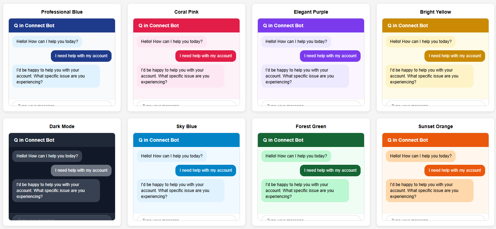

# Quick CSS guide for Lex Web Ui

The ability to update the style of the lex-web-ui to conform to an existing site's style
is important. This guide will walk you through adjusting the UI to meet your needs.

This guide does not cover the case if you are building lex-web-ui for use as a component
in other Vue apps or modifing Vue source components for your own implementation.

There are two mechanisms to modify and deploy the custom-chatbot-style.css file using the style
modifications outlined in this README.

* Prebuilt lex-web-ui distribution 
  
  If you have installed the lex-web-ui using the prebuilt distributions from the links published on
  the lex-web-ui blog post or from the links available in the top level README.md, follow these steps.
    * Download the custom-chatbot-style.css file from your WebApp S3 bucket
    * Modify the CSS accordingly and save the file locally on your desktop
    * Upload the custom-chatbot-style.css back to your WebApp S3 bucket
    * Use the CloudFront console to invalidate the CloudFront distribution such that it will be served up immediately
  
## Summary of available css modifications


## Iframe width and height

As noted on the bottom of the diagram, if using a parent page to host the lex-web-ui as an iframe,
the iframe size and width and position an be controlled using css applied to the parent page.

```shell script
.lex-web-ui-iframe {
    min-width: 25vw !important;
    max-height: 315px !important;
    margin-right: 10vw !important;
    margin-bottom: 10px !important;
}
```
Note that these values can be specified using vw and vh to reflect percentages of the view
window's width and height.

## Style for elements of the Lex-Web-Ui
Use the following process to set style after the lex-web-ui has been deployed.

*Note: Version 0.14.11 pre-installs with the file custom-chatbot-style.css and pre-configures its use in index.html.
Download the file from S3. Follow steps 2 and 3. The default file has all styles commented out. Enable style changes
you desire and upload the file back to S3.

1) Create a new css file named 'custom-chatbot-style.css'.
2) Configure/update the style as needed
3) Upload the 'custom-chatbot-style.css' file to the S3 bucket hosting the lex-web-ui.
4) Download and modify the index.html file from the S3 bucket. Insert the html below
within the \<head\> element at the end of this element.
5) Upload the index.html back to the S3 bucket.

Changes for index.html for versions prior to 0.14.11.
```
<link rel="stylesheet" href="./custom-chatbot-styles.css">
```

The new css file will then hold style changes for the elements in the UI.

### Toolbar
#### Toolbar Background Color
There are two distinct mechanisms for changing the background color.
1) Update lex-web-ui-loader-config.json. Change the property ui.toolbarColor. You must select a value
from.
https://vuetifyjs.com/en/styles/colors#
2) OR use the following in css to overwrite the color of the default red CSS
```
.bg-red {
  background-color: #2b2b2b !important;
}
```

#### Toolbar font and color
```
.toolbar__title {
  font-family:"Sans-serif" !important;
  font-size: 16px !important;
  color: #ffffff !important;
}
```

#### Toolbar logo - easily set in lex-web-ui-loader-config.json
Modify lex-web-ui-loader-config.json
```
ui.toolbarLogo: "url"
```

### Minimized button tooltip content
Modify lex-web-ui-loader-config.json
```
"minButtonToolTipContent": "My Chatbot",
```

### Minimized button color
```css
button.min-button {
    background-color: blue !important;
    border-color: blue !important;
}
```

#### Message Avatar Icons - easily set in lex-web-ui-loader-config.json
Modify lex-web-ui-loader-config.json
```
ui.avatarImageUrl: "url"
ui.agentAvatarImageUrl: "url"
```

#### Message List background color
```
.message-list-container {
  background-color: #fefefe !important
}
```

#### Messages from bot
Set background of the bot's response messages
```
.message-bot .message-bubble {
  background-color: #eeedeb !important;
}
```

#### Messages from human
```
.message-human .message-bubble {
  background-color: #afcffa !important;
}
```
//todo verify and set
##### Hide the first input message / initial utterance
```
.message-human:first-of-type {
  display:none;
}
```

#### Message bubble margins
```
.message-bubble p {
    margin-bottom: 8px;
}

.message-bubble p:last-child {
    margin-bottom: 0px;
}
```

#### Message bubble borders
```
.message-bubble {
    border-radius: 10px !important;
    padding: 2px 18px !important;
}
```

#### Message bubble text
```
.message-bubble .message-text {
    padding-left:  0;
    padding-right: 0;
    line-height: 1.6;
    font-size: 1rem;
}
```

#### Message text color
````
.message-text {
  color: #000000
}
````

#### Response card titles and text
```
.headline {
    font-size: 1.2rem !important;
    line-height: 1.4 !important;
}

.card__title {
    padding: 10px 16px !important;
}

.card__text {
    padding: 8px 16px 16px !important;
    line-height: 1.4;
}
```

#### Response card buttons - margins, background-color
```
.v-card-actions .v-btn {
  margin: 4px 4px !important;
  font-size: 1em !important;
  min-width: 44px !important;
  background-color: #afcffa !important;
}
```

#### Input text area font size
```
.input-group--text-field input,
.input-group--text-field textarea,
.input-group--text-field label {
    font-size: 14px !important;
}
```

#### End Connect Live Chat Button
```
button.end-live-chat-button.btn {
  color: white !important;
  background-color: red !important
}
```

#### Other
Other CSS can be applied to the classes above in addition to what is listed. Be creative and
create a compelling style for your site.

## Lex Web Ui Example CSS Files
some examples for custom css styles are available [here](#example-css) 

