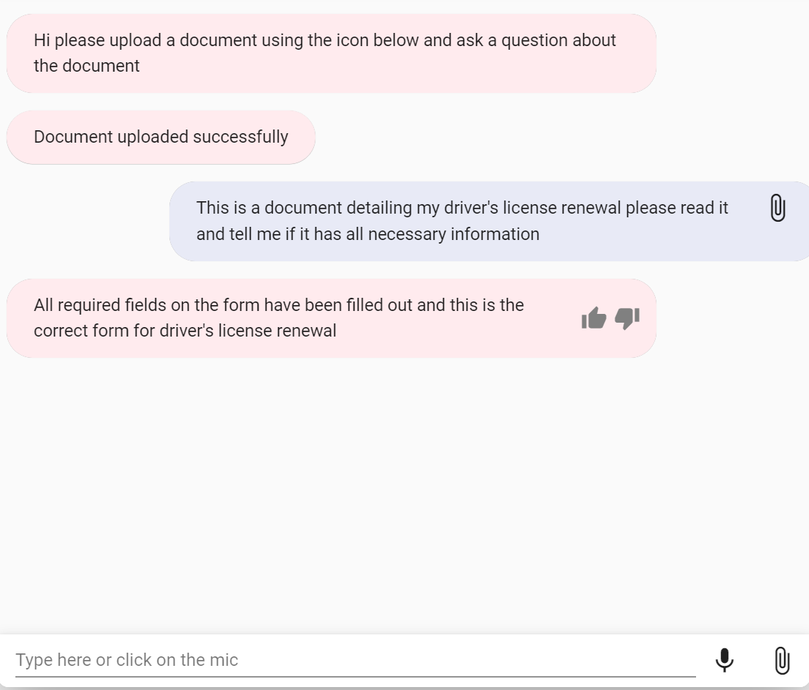

# Lex File Uploads

This feature allows users of the Lex Web UI to upload documents directly to a designated S3 bucket. This feature can be used to analyize documents or extract specific information using other AWS services through Lambda fulfillment in your Lex bot. When the user uploads a document, it is stored in the designated S3 bucket at a path location specific to that user. The location of the document in S3 is then set as a sessionAttribute in the Lex bot so that downstream processes can locate and retrieve the document.



**Note** - For security, upload functionality is only available for logged in users. To support anonymous uploading, you will need to configure your own IAM policies in Cognito and manually set `uploadRequireLogin` to false in your `lex-web-ui-loader-config.json` file. Allowing anonymous uploading of documents is not recommended.

## Deploy or update the Lex Web UI Stack

To turn on support for uploading documents into S3 via the Lex Web UI, you will need a pre-existing S3 bucket to serve as the repository for these documents. This repostiory will need a CORS configuration that allows the uploaded documents to be sent from the source of your Lex Web UI (instructions below for configuration).

To enable uploading via the Cloud Formation template, update the following parameters:
- `ShouldEnableUpload` to true
- `UploadBucket` to the bucket name of the S3 bucket that will store the documents

## Working with uploaded documents in session attributes

When a document is uploaded via the UI, its location and filename are added as a JSON object into the sessionAttributes of the bot as shown below. A timestamp is added to the document name and a folder structure is created so individual users and files can be properly differentiated. The original filename is retained in the session attributes. Your fulfillment Lambda can add to this object as needed, but the `s3Path` and `fileName` properties should remain to ensure the Web UI functions propertly.

```
{
  "s3Path": "s3://atj-demo-faqs/{sessionId}/{filename}-{timestamp}.txt",
  "fileName": "todo-logging.notes.txt"
}
```

## Configuring CORS in the destination S3 bucket

CORS configuration is **not** part of the CloudFormation template deployment and must be done by the user for uploading of documents to work. For CloudFormation deployments, the allowed origin for the CORS policy is the location of the deployed Web UI files in CloudFront, not the parent origin. You can find this origin in the outputs of your template deployment, including in the `WebAppUrl` output.

Here is an example CORS policy for an S3 bucket:
```
[
    {
        "AllowedHeaders": [
            "*"
        ],
        "AllowedMethods": [
            "PUT"
        ],
        "AllowedOrigins": [
            "https://xxxxxxxxxxxx.cloudfront.net"
        ],
        "ExposeHeaders": [],
        "MaxAgeSeconds": 3000
    }
]
```

## Additional post deployment configuration

To update the success & failure messages associated with document upload, add the following configuration items to the `ui` section of your `lex-web-ui-loader-config.json` file (this file is deployed into the webapp bucket during Cloudformation deployment):
- uploadSuccessMessage
- uploadFailureMessage

If these values are not set your users will see the default messages for uploading.
