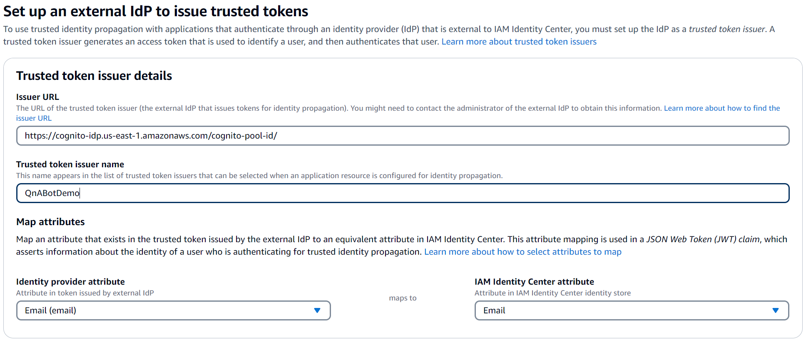
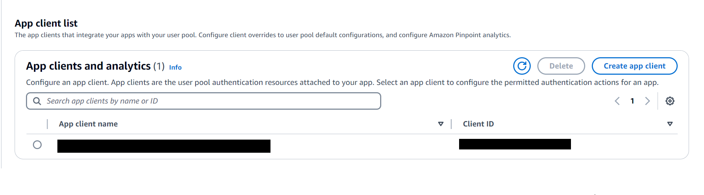
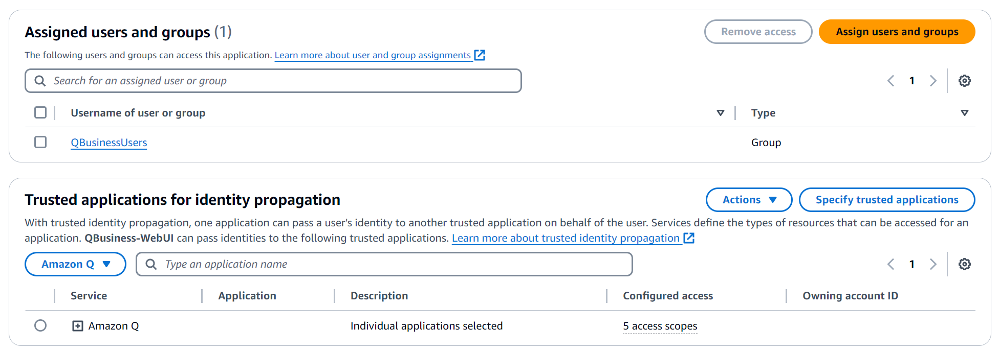
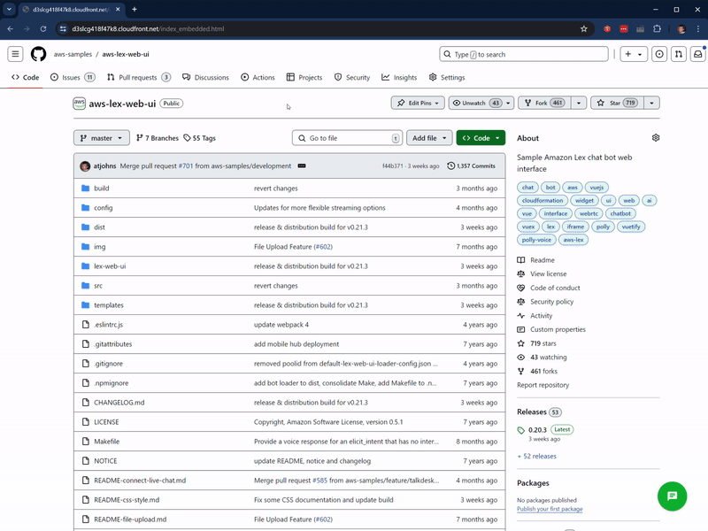

# Amazon Q Business Integration

Amazon Q is a new generative AI-powered application that helps users get work done. Amazon Q can become your tailored business expert and let you discover content, brainstorm ideas, or create summaries using your company’s data safely and securely. For more information see: [Introducing Amazon Q, a new generative AI-powered assistant](https://aws.amazon.com/blogs/aws/introducing-amazon-q-a-new-generative-ai-powered-assistant-preview)

This feature of the Web UI lets you use Amazon Q's generative AI directly with the Web UI, using a deployed sample bot as a passthrough to the Q Business application. This allows your solution to take advantage of the native Web UI features - embedding, customization, etc - while still leveraging the answering capabilities of Amazon Q.

This feature supports integration with file attachments, enable both to allow QBusiness to read files uploaded via Lex Web UI. There's more information on this feature in the [File Upload README](https://github.com/aws-samples/aws-lex-web-ui/blob/master/README-file-upload.md). 

**Note:*** - The default deployed solution will return a failure message if the user is not logged in or does not have a valid Q Business subscription. This can be customized in the Fulfilment Lambda that is deployed by the CloudFormation template.

### Prerequisites
1. An existing deployment of a Q Business application is required for this solution. Please reference the AWS docs for creating a new [Q Business application](https://docs.aws.amazon.com/amazonq/latest/qbusiness-ug/create-application.html)

### Deploy the Web UI
1. A deployment of the Lex Web UI with login enabled is required for Q Business integration. To launch a new deployment of the Web UI, go to the main [README](https://github.com/aws-samples/aws-lex-web-ui/blob/master/README.md) and select `Launch` for the region where your Q Business app is deployed.

2. The other bot fields for both V1 & V2 bots must be empty for the template to create the Q Business integration bot, please ensure that `Lex V1 Bot Configuration Parameters` and `Lex V2 Bot Configuration Parameters` are blank.

3. To enable login, set `EnableCognitoLogin` to true. To force users to login to your bot, set `ForceCognitoLogin` to true. The ForceCognitoLogin setting will automatically redirect users to the login page if they are not logged in to the bot. 

4. In the `Q Business Parameters` section of the template, provide the Amazon Q Application ID. For now, leave the 'IDCApplicationARN' field blank. This application must be created after Cognito is deployed by the initial Web UI deployment and the stack can be updated later to provide this value.

5. Deploy the stack.

6. When the stack is finished deploying (showing a CREATE_COMPLETE status) go the Outputs tab. You will need the following Outputs for setting up the Identity Center Application:
    - CognitoUserPoolClientId
    - CognitoUserPoolPubKey
    - QBusinessLambdaRoleARN

### Creating an Trusted token issuer in Identity Center

1. The Cognito user pool created by the Web UI will need to be added as **Trusted token issuer** to Identity Center by doing the following steps. Note that if you are not an admin in your organization, an administrator with Identiy Center access might need to create the token issuer and application.
    1. Go to Identity Center and click on `Settings`, click the `Authentication` tab and then scroll down and select `Create trusted token issuer`
    2. The issuer URL will be the **CognitoUserPoolPubKey, but remove /.well-known/jwks.json from the end of the URL**, the issuer URL you supply shoudl be in the form of  `https://cognito-idp.[region].amazonaws.com/[cognito-pool-id]`. The application also needs to be provided with attribute mapping between Identity Center and Cognito to recognize users, this should be a unique attribute for each user (the default is email address)
        
    3. With a trusted token issuer in place, the custom application can now be created.

### Creating a Identity Center Application w/ Cognito trust

1. A custom application will need to be created in Identity Center to handle the connection between your Q Business application and your Cognito pool. Follow these steps to create the application.
    1. Go to Identity Center and click on `Applications` then `Add application`
    2. Select `I have an application I want to set up` and `OAuth 2.0` on the next page for Selecting Application type, then hit `Next`
    3. For `Application URL`, provide the **Web experience URL** of your Q Business application. You can either opt to assign specific users/groups to this application or allow any Identity Center users/groups to access the application. Your Q Business subscriptions will still apply however so only users with a subscription can successfully chat with the application. Then hit `Next`.
    4. Select the Trusted token issuer that was created in Step 2 of this guide, you will now need an aud claim so that the token issuer can identify the application. The aud claim is the **CognitoUserPoolClientId** output value from the Web UI stack. Take this value and paste it into the aud claim field, then select `Next`
        
    5. Under `Enter IAM roles`, take the role that was created by the Web UI stack for the QBusiness Lambda function. This is the **QBusinessLambdaRoleARN**. Paste this value into field and select `Next`.
    6. Hit `Submit` to complete creation of the application.
    7. The application is accessible under the `customer managed` tab of the Identity Center applications. Select the just created application to make changes. 
    8. Depending on the selection in step 3 above, users may still need to be assigned to the application. These will be the same users you have assigned to the Q Business application.
    7. Finally, make Amazon Q a trusted application for identity propagation by selecting `Specify trusted applications` and finding QBusiness in the list of potential application for trust. When complete your app should appear similar to the below configuration
        
    8. Copy the `Application ARN` found on this page, it will be used to update the Lex Web UI stack.

### Adding users to Cognito

1. Any user who has a Q Business subscription will need a user account in Cognito, linked by the attribute mapping defined when the `Trusted token issuer` was created.
2. These users can be added manually or by integrating it via [SAML to a 3rd party provider](https://docs.aws.amazon.com/cognito/latest/developerguide/cognito-user-pools-integrating-3rd-party-saml-providers.html).

### Update the Lex Web UI stack

1. Return to CloudFormation and click on the stack that was initially used to deploy the Web UI.
2. On the top-right menu, select `Update`
3. Leave the default of 'Use existing template' and hit `Next`
4. Under Q Business Parameters, find the **IDCApplicationARN** and paste the `Application ARN` copied at the end of the previous section.
5. Launch the update of the stack.

## Validate deployment

Your deployment of the Web UI should now talk directly to Amazon Q Business and return the same responses as the default web experience. In addition, by turning on upload capabilities you can ask Q Business questions about documents and get GenAI answers.

 
