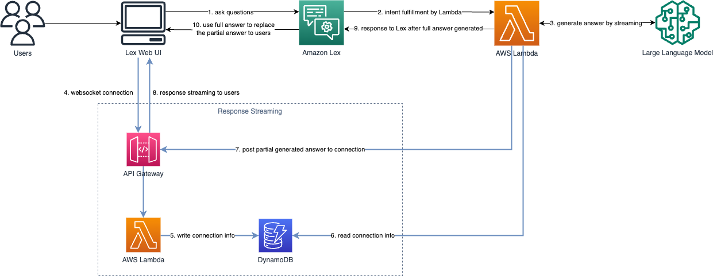
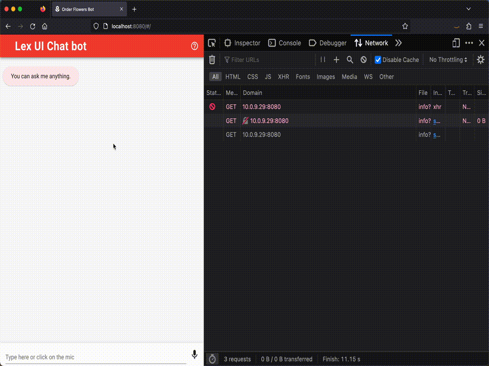

# Lex Streaming Responses

In addition to the documentation below, a full workshop walking through how to integrate streaming responses is also [available here](https://catalog.us-east-1.prod.workshops.aws/workshops/5a58b6a0-7af6-49ce-a907-1a28568eeca1/en-US).

This feature allows users of the Lex Web UI to stream responses back from their bot to the Web UI client. This feature can be used to execute long running tasks and report back progress from an API or series of API calls, or to enable streaming responses from a large language model through services like Amazon Bedrock.

When this feature is turned on, the following architecture can be implemented to stream from your bot to the Web UI.
Note that the Cloudformation will deploy the resources on the bottom of the diagram below, but the fullfilment Lambda
must be created by the bot developer for integration with their long-running task.



## Setup

## Deploy or update the Lex Web UI Stack

To turn on streaming support for Lex Web UI, set the AllowStreamingResponses flag to true and deploy the solution.

This will run a child template in the stack, which will add the following resources:
- API Gateway WebSocket
- DynamoDB Table
- Lambda function

When your bot is first visited by a user with streaming support enabled, the bot will establish a web socket connection to the deployed API gateway. It will send any messages you put on the websocket back to the Web UI, enabling the user to receive messages that have not yet been returned by the Lambda fullfilment process. By default, the API Gateway is deployed without authentication and a 1,000 request per day quota.

When the final response comes back from Lex, it will replace the streamed responses with the final response and apply any custom formating (Markdown, HTML) to the message. Note that no formatting will be applied to the streamed text.

## Creating a fullfilment Lambda that implements streaming

Once the stack creation has completed, the resources you'll need to enable streaming for Lex Web UI will be in place. However, you will still need to implement your own fullfilment Lambda function that pushes messages to the websocket connection for the Web UI to display.

Here is an example fullfilment lambda that could be used for integrating to Amazon Bedrock, in this case using the Claude instant model for answering questions. In the example below, note a few important steps that will be needed for your fullfilment lambda to properly stream to the Web UI.

1. The Lambda will need two variables coming from the session attributes of the Web UI - the name of the Dynamo table that was created and the endpoint URL of the API Gateway that was created. If these attributes are not present then streaming is not enabled on the Web UI.

2. The fullfilment Lambda must get items from the DynamoDB table, using the session ID as the key. When a user initiates a session, the session ID is sent to the Websocket API and stored along with a connection ID in DynamoDB. The fullfilment Lambda needs to get this value so it knows where to push its streaming updates.

3. As the response is processing (in this case our LLM is returning chunks of the response), we push these updates to our Websocket using ```apigatewaymanagementapi.post_to_connection``` which will send those updates back to the client via the Websocket connection.


```
import boto3
import os
import json
from asyncio import get_event_loop, gather, sleep

AWS_REGION = os.environ["AWS_REGION"]
ENDPOINT_URL = os.environ.get("ENDPOINT_URL", f'https://bedrock-runtime.{AWS_REGION}.amazonaws.com')
modelId = "anthropic.claude-instant-v1" 
accept = "application/json"
contentType = "application/json"

dynamodb_client = boto3.resource('dynamodb')
bedrock_runtime = boto3.client(service_name='bedrock-runtime', region_name=AWS_REGION, endpoint_url=ENDPOINT_URL)
s3 = boto3.client('s3')

def lambda_handler(event, context):
    print('event: ', event)
    response = router(event, context)
    return response
    

def router(event, context):
    intent_name = event['sessionState']['intent']['name']

    # Dispatch to your bot's intent handlers
    sess_id = event['sessionId']

    #if intent_name == 'FallbackIntent':
    result = get_event_loop().run_until_complete(openai_async_api_handler(event, context))
    print(result)
    return result        
    
    raise Exception('Intent with name ' + intent_name + ' not supported')
    
    
## Note that the prefix async
async def openai_async_api_handler(event, context):
    
    sessionId = event['sessionId']
    inputTranscript = event['inputTranscript']
    body = json.dumps({"prompt": "Human: " + inputTranscript + "Assistant:", "max_tokens_to_sample": 500})
    session_attributes = get_session_attributes(event)
    print('sessionId ', sessionId)
    print('inputTranscript ', inputTranscript)
    fullreply = '';
    
    #If streaming, call Bedrock with streaming and push chunks to Websocket
    if hasattr(session_attributes, 'streamingDynamoDbTable') and hasattr(session_attributes, 'streamingEndpoint'):
        apigatewaymanagementapi = boto3.client(
            'apigatewaymanagementapi', 
            endpoint_url = session_attributes['streamingEndpoint']
        )
        
        wstable = dynamodb_client.Table(session_attributes['streamingDynamoDbTable'])
        db_response = wstable.get_item(Key={'sessionId': sessionId})
        print (db_response)
        connectionId = db_response['Item']['connectionId']
        print('Get ConnectionID ', connectionId)

        response = bedrock_runtime.invoke_model_with_response_stream(
            body=body, modelId=modelId, accept=accept, contentType=contentType
        )
        stream = response.get('body')

        if stream:
            for streamEvent in stream:
                chunk = streamEvent.get('chunk')
                if chunk:
                    chunk_obj = json.loads(chunk.get('bytes').decode())
                    text = chunk_obj['completion']
                    fullreply = fullreply + text
                    print(text)
                    response = apigatewaymanagementapi.post_to_connection(
                        Data=text,
                        ConnectionId=connectionId
                    )
    #If not streaming, generate a reponse and return
    else:
        response = bedrock_runtime.invoke_model(
            body=body, modelId=modelId, accept=accept, contentType=contentType
        )
        response_body = json.loads(response["body"].read())
        fullreply = response_body["completion"]
    
    message = {
        'contentType': 'CustomPayload',
        'content': fullreply
    }
    fulfillment_state = "Fulfilled"
    
    return close(event, session_attributes, fulfillment_state, message)


#------------------------------------------------------------


def get_session_attributes(intent_request):
    print(intent_request)
    sessionState = intent_request['sessionState']
    if 'sessionAttributes' in sessionState:
        print('Session Attributes', sessionState['sessionAttributes'])
        return sessionState['sessionAttributes']

    return {}


def close(intent_request, session_attributes, fulfillment_state, message):
    intent_request['sessionState']['intent']['state'] = fulfillment_state

    return {
        'sessionState': {
            'dialogAction': {
                'type': 'Close'
            },
            'intent': intent_request['sessionState']['intent']
        },
        'messages': [message],
        'sessionId': intent_request['sessionId'],
        'requestAttributes': intent_request['requestAttributes'] if 'requestAttributes' in intent_request else None
    }
```

## Example Demo


