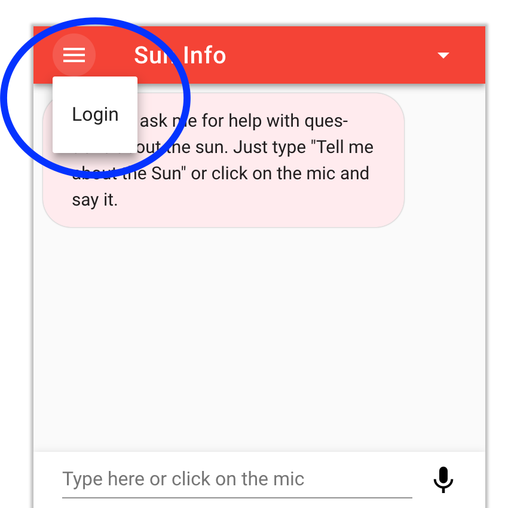
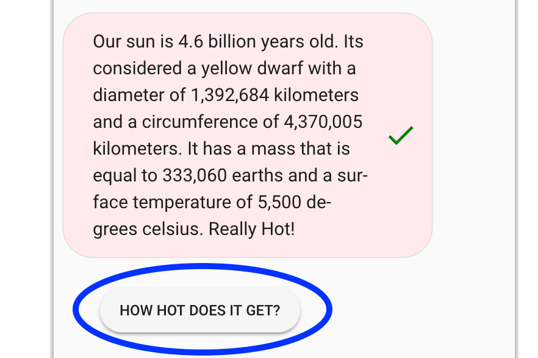
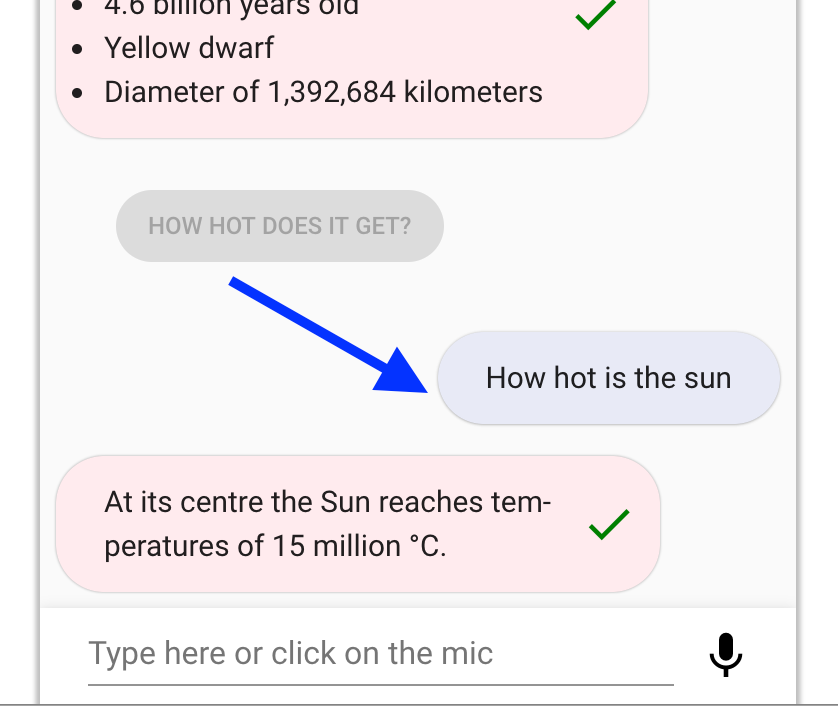
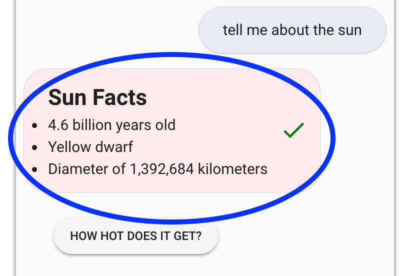

# Sample Amazon Lex Web Interface

> Sample Amazon Lex Web Interface

# Overview
This is a sample [Amazon Lex](https://aws.amazon.com/lex/)
web interface. It provides a chatbot UI component that can be integrated
in your website. The interface allows a user to interact with a Lex bot directly
from a browser using text or voice.

####Features include:
- Mobile ready responsive UI with full page or embeddable widget modes
- Support for voice and text with the ability to seamless switch from
one mode to the other
- Voice support provides automatic silence detection, transcriptions
and ability to interrupt responses and replay recordings
- Display of Lex response cards
- Ability to programmatically configure and interact with the chatbot
UI using JavaScript

#### New Features in version 0.14.0
* Optionally support user login via Cognito User Pool and supports other Identity Providers

* Improved clickable response card button formatting / optional titles


* Support of Markdown from Lex 

* Additional lex-web-ui parameters can be configured via CloudFormation template

#### Ways the lex-web-ui chatbot can be deployed

It can be used as a full page chatbot UI:


Or embedded into an existing site as a chatbot widget:


# Getting Started
The easiest way to test drive the chatbot UI is to deploy it using the
[AWS CloudFormation](https://aws.amazon.com/cloudformation/) templates
provided by this project. Once you have launched the CloudFormation stack,
you will get a fully working demo site hosted in your account.


Click this button to launch it:

<a target="_blank" href="https://console.aws.amazon.com/cloudformation/home?region=us-east-1#/stacks/new?stackName=lex-web-ui&templateURL=https://s3.amazonaws.com/aws-bigdata-blog/artifacts/aws-lex-web-ui/artifacts/templates/master.yaml"><span></span></a>

By default, the CloudFormation template
creates a sample Lex bot and a [Amazon Cognito Identity
Pool](http://docs.aws.amazon.com/cognito/latest/developerguide/identity-pools.html)
to get you started. It copies the chatbot UI web application to an
[Amazon S3](https://aws.amazon.com/s3/) bucket including a dynamically
created configuration file. The CloudFormation stack outputs links to
the demo and related configuration once deployed. See the [CloudFormation
Deployment](#cloudformation-deployment) section for details.

You can modify the configuration of the deployed demo site to customize
the chatbot UI. It can also be further configured to be embedded it on
your web site. See the sections below for code samples and a description
of the configuration and deployment options.

# Integrating into your Site and Deploying
In addition to the CloudFormation deployment mentioned above, there are
other methods to integrate and deploy this project. Here is a summary
of the various methods:

| # | Method | Description | Use Case |
| --- | --- | --- | --- |
| 1 | [CloudFormation Deployment](#cloudformation-deployment) using the CloudFormation [templates](templates) provided by this project | Fully automated deployment of a hosted web application to an S3 bucket with an optional CI/CD pipeline. By default, it also creates a Cognito Identity Pool and a sample Lex bot | Use when you want to have a infrastructure as code approach that automatically builds and configures the chatbot UI resources |
| 2 | [Mobile Hub Deployment](#mobile-hub-deployment) using the import file: [lex-web-ui-mobile-hub.zip](dist/lex-web-ui-mobile-hub.zip) | Deploys a pre-built version of the chatbot UI to S3 and CloudFront. It creates the Cognito Identity Pool and a sample Lex bot. You can use the Mobile Hub Console to manage it or make changes (e.g. linking to another bot) | Use when you want an easy deployment using the AWS Console or for quick manual testing |
| 3 | Use the pre-built [libraries](#libraries) from the [dist](dist) directory of this repo | We provide a pre-built version of the chatbot UI component and a loader library that you can use on your web site as a [stand alone page](#stand-alone-page) or as an embeddable [iframe](#iframe) | Use when you have an existing site and want to add the chatbot UI to it by simply copying or referencing the library files |
| 4 | Use npm to install and use the chatbot UI as a Vue component | Enables developers to consume this project as an [npm](https://www.npmjs.com/) package that provides a [Vue](https://vuejs.org/) component. See the [Npm Install and Vue Component Use](#npm-install-and-vue-component-use) section for details | Use when developing front-end based web applications built using JavaScript and bundled with tools such as [webpack](https://webpack.github.io) |

See the [Usage](#usage) and [Deployment](#deployment) sections below for details.

# Usage
This project provides a set of JavaScript libraries used to dynamically
insert the chatbot UI in a web page. The chatbot UI is loaded and
customized by including these libraries in your code and calling their
functions with configuration parameters.

The chatbot UI can be displayed either as a full page or embedded
in an iframe. In this section, you will find a brief overview of
the libraries and configuration parameters. It is useful to get
familiar with the concepts described in the [Libraries](#libraries)
and [Configuration](#configuration) sections before jumping to the code
[examples](#examples).

## Libraries
The list below describes the libraries produced by this project.
Pre-built versions of the libraries are found under the [dist](/dist)
directory of this repository.

1. **Chatbot UI component**. A UI widget packaged as a JavaScript reusable
component that can be plugged in a web application. The library is
provided by the `lex-web-ui.js` file under the [dist](dist) directory. It
is bundled from the source under the [lex-web-ui](lex-web-ui)
directory. This library is geared to be used as an import in a webpack
based web application but can also be instantiated directly in a web page
provided that you manually load the dependencies and explicitly pass
the configuration. See the component's [README](lex-web-ui/README.md)
for details
2. **Loader**. A script that adds the chatbot UI component library
described in the item above to a web page. It facilitates the
configuration and dependency loading process. The library
is provided by the `lex-web-ui-loader.js` file under the
[dist](dist) directory. It is bundled from the sources under the
[src/lex-web-ui-loader](src/lex-web-ui-loader) directory. This library
is used by adding a few script tags to an HTML page. See the loader
[README](src/README.md) for details

## Configuration
The chatbot UI component requires a configuration object
pointing to an existing Lex bot and to an [Amazon Cognito Identity
Pool](http://docs.aws.amazon.com/cognito/latest/developerguide/identity-pools.html)
to create credentials used to authenticate the Lex API calls from the
browser. The configuration object is also used to customize its behavior
and UI elements of the chatbot UI component.

The CloudFormation and Mobile Hub deployment methods, from this project,
help with building a base configuration file. When deploying with those
methods, the base configuration is automatically pointed to the the
resources created in the deployment (i.e. Lex and Cognito).

You can override the configuration at run time by passing
parameters to the library functions or using various dynamic
configuration methods provided by the loader library (e.g. JSON
file, events). For details, see the [ChatBot UI Configuration
Loading](/src/README.md#chatbot-ui-configuration-loading) section
of the loader library documentation and the [Configuration and
Customization](/lex-web-ui/README.#configuration-and-customization)
section of the chatbot UI component documentation.

## Examples
The examples below are organized around the following use cases:
1. [Stand-Alone Page](#stand-alone-page)
2. [Iframe](#iframe)
3. [Npm Install and Vue Component Use](#npm-install-and-vue-component-use)

### Stand-Alone Page
To render the chatbot UI as a stand-alone full page, you can use two
alternatives: 1) directly use the chatbot UI component library or 2)
use the loader library. These libraries (see [Libraries](#libraries))
provide pre-built JavaScript and CSS files that are ready to be included
directly into an HTML file to display a full page chatbot UI.

When you use the chatbot UI component directly, you have to manually
load the component's dependencies and provide its configuration as a
parameter. The loader library alternative provides more configuration
options and automates the process of loading dependencies. It encapsulates
the chatbot UI component in an automated load process.

#### Stand-Alone Page Using the Loader Library
The loader library provides the easiest way to display the chatbot UI. The
entry point to this library is the `lex-web-ui-loader.js` script. This
script facilitates the process of loading run-time dependencies and
configuration.

If you deploy using the CloudFormation or Mobile Hub methods, you will
get an S3 bucket with the loader library script and related files in a
way that is ready to be used. Alternatively, you can copy the files from
the `dist` directory of this repository to your web server and include the
loader.

In its most simple setup, you can use the loader library like this:
```html
<!-- include the loader library script -->
<script src="./lex-web-ui-loader.js"></script>
<script>
  /*
    The loader library creates a global object named ChatBotUiLoader
    It includes the FullPageLoader constructor
    An instance of FullPageLoader has the load function which kicks off
    the load process
  */

  // The following statement instantiate FullPageLoader and
  // calls the load function.
  // It is assumed that the configuration is present in the
  // default JSON file: ./lex-web-ui-loader-config.json
  new ChatBotUiLoader.FullPageLoader().load();
</script>
```

#### Stand-Alone API through the Loader Library

Similar to the iFrame loading technique described later, the 
FullPageComponentLoader now provides an API allowing a subset of
events to be sent to the Lex Web UI Component. These events are
ping and postText. See the [full page](src/README.md#full-page) for 
description of this API. 

#### Stand-Alone details

For more details and other code examples about using the loader script
in a full page setup, see the [full page](src/README.md#full-page)
section of the loader documentation. You can also see the source of the
[index.html](src/website/index.html) page used in the demo site.

#### Stand-Alone Page Directly Using the ChatBot UI Component
Directly loading the chatbot UI component works at a lower level than
using the loader library as described above. This approach can be used
if you want to manually control the rendering, configuration and
dependency loading process.

The entry point to the chatbot UI component is the `lex-web-ui.js`
JavaScript file. The UI CSS styles are contained in the `lex-web-ui.css`
file. The component depends on the [Vue](https://vuejs.org/),
[Vuex](https://vuex.vuejs.org/), [Vuetify](https://vuetifyjs.com/)
and [AWS SDK](https://aws.amazon.com/sdk-for-browser/) libraries. You
should either host these dependencies on your site or load them from a
third-party CDN.

The HTML code below is an illustration of directly loading the chatbot UI
library and its dependencies.

**NOTE**: The versions of the links below may need to be pointed
to the latest supported versions.

```html
<html>
  <head>
    <!-- Font Dependencies -->
    <link href="https://fonts.googleapis.com/css?family=Roboto:300,400,500,700|Material+Icons" rel="stylesheet" type="text/css">

    <!-- Vuetify CSS Dependencies -->
    <link href="https://unpkg.com/vuetify@0.16.9/dist/vuetify.min.css" rel="stylesheet" type="text/css">

    <!-- LexWebUi CSS from dist directory -->
    <link href="./lex-web-ui.css" rel="stylesheet" type="text/css">
    <!-- page specific LexWebUi styling -->
    <style type="text/css">
      #lex-web-ui-app { display: flex; height: 100%; width: 100%; }
      body, html { overflow-y: auto; overflow-x: hidden; }
    </style>
  </head>
  <body>
    <!-- application will be dynamically mounted here -->
    <div id="lex-web-ui"></div>

    <!--
      Vue, Vuex, Vuetifiy and AWS SDK dependencies must be loaded before lex-web-ui.js.
      Loading from third party CDN for quick testing
    -->
    <script src="https://unpkg.com/vue@2.5.3"></script>
    <script src="https://unpkg.com/vuex@3.0.1"></script>
    <script src="https://unpkg.com/vuetify@0.16.9"></script>
    <script src="https://sdk.amazonaws.com/js/aws-sdk-2.149.0.min.js"></script>

    <!-- LexWebUi Library from dist directory -->
    <script src="./lex-web-ui.js"></script>

    <!-- instantiate the web ui with a basic config -->
    <script>
      // LexWebUi supports numerous configuration options. Here
      // is an example using just a couple of the required options.
      var config = {
        cognito: {
          // Your Cognito Pool Id - this is required to provide AWS credentials
          poolId: '<your cognito pool id>'
        },
        lex: {
          // Lex Bot Name in your account
          botName: '<your lex bot name>'
        }
      };
      // load the LexWebUi component
      var lexWebUi = new LexWebUi.Loader(config);
      // instantiate Vue
      new Vue({
        el: '#lex-web-ui',
        store: lexWebUi.store,
        template: '<div id="lex-web-ui-app"><lex-web-ui/></div>',
      });
    </script>
  </body>
</html>
```
### Iframe
You can embed the chatbot UI into an existing page using an iframe.
This approach provides a self-contained widget that can interact with
the parent page hosting the iframe. The `lex-web-ui-loader.js` loader
library provides the functionality to add it as an iframe in a page.

This loader script dynamically creates the iframe tag and supports
passing asynchronous configuration using events and JSON files. It also
provides an API between the iframe and the parent page which can be used
to pass Lex state and other events. These features are detailed in the
[Iframe Embedding](src/README.md#iframe-embedding) section of the library.

The HTML code below is a basic example of a parent page that adds the
chatbot UI as an iframe. In this scenario, the libraries and related
files from the `dist` directory of this repo are hosted in the same
directory as the parent page.

Please note that the `loaderOptions` variable has an `iframeSrcPath`
field which defines the path to the full page chatbot UI. This variable
can be pointed to a page like the one described in the [stand-alone
page](#stand-alone-page) section.

```html
<html>
  <head>
    <title>My Parent Page</title>
  </head>
  <body>
    <h1>Welcome to my parent page</h1>
    <!-- loader script -->
    <script src="./lex-web-ui-loader.js"></script>
    <script>
      /*
        The loader library creates a global object named ChatBotUiLoader
        It includes the IframeLoader constructor
        An instance of IframeLoader has the load function which kicks off
        the load process
      */

      // options for the loader constructor
      var loaderOptions = {
        // you can put the chatbot UI config in a JSON file
        configUrl: './chatbot-ui-loader-config.json',

        // the full page chatbot UI that will be iframed
        iframeSrcPath: './chatbot-index.html#/?lexWebUiEmbed=true'
      };

      // The following statement instantiates the IframeLoader
      var iframeLoader = new ChatBotUiLoader.IframeLoader(loaderOptions);

      // chatbot UI config
      // The loader can also obtain these values from other sources such
      // as a JSON file or events. The configUrl variable in the
      // loaderOptions above can be used to put these config values in a file
      // instead of explicitly passing it as an argument.
      var chatbotUiConfig = {
        ui: {
          // origin of the parent site where you are including the chatbot UI
          // set to window.location.origin since hosting on same site
          parentOrigin: window.location.origin,
        },
        iframe: {
          // origin hosting the HTML file that will be embedded in the iframe
          // set to window.location.origin since hosting on same site
          iframeOrigin: window.location.origin,
        },
        cognito: {
          // Your Cognito Pool Id - this is required to provide AWS credentials
          poolId: '<your cognito pool id>'
        },
        lex: {
          // Lex Bot Name in your account
          botName: '<your lex bot name>'
        }
      };

      // Call the load function which returns a promise that is resolved
      // once the component is loaded or is rejected if there is an error
      iframeLoader.load(chatbotUiConfig)
        .then(function () {
          console.log('iframe loaded');
        })
        .catch(function (err) {
          console.error(err);
        });
    </script>
  </body>
</html>
```
For more examples showing how to include the chatbot UI as an iframe,
see the source of the [parent.html](src/website/parent.html) page and the
[Iframe Embedding](src/README.md#iframe-embedding) documentation of the
loader library.

### Npm Install and Vue Component Use
You can use the [npm](https://docs.npmjs.com/) package manager to
install this project. The npm installation provides a library that you
can import as a module into your JavaScript code. The component is built
as a reusable [Vue](https://vuejs.org/) plugin. This approach is geared
to be used in a [webpack](https://webpack.github.io) based project.

Package installation using `npm`:

```shell
# install npm package from github repo
npm install --save awslabs/aws-lex-web-ui
# you may need to install co-dependencies:
npm install --save vue vuex vuetify material-design-icons roboto-fontface
```

This is a quick example showing how to import the library in your project:

```JavaScript
// assumes that a bundler like webpack will handle import/require
// using es6 module
import LexWebUi from 'aws-lex-web-ui';
// or using require
var LexWebUi = require('aws-lex-web-ui');
// import the debug non-minimized version
import LexWebUi from 'aws-lex-web-ui/dist/lex-web-ui';
```

The source of the chatbot UI component resides under the
[lex-web-ui](lex-web-ui) directory. For further details about the chatbot
UI component see its [README](lex-web-ui/README.md) file.

### Sample Site
This repository provides a sample site that you can use as a base
for development. The site is a couple of HTML pages can be found
in the [src/website](src/website) directory. The pages includes the
[index.html](src/website/index.html) file which loads the chatbot UI
in a stand-alone page and the [parent.html](src/website/parent.html)
which page loads the chatbot UI in an iframe.

These pages are the same ones that are deployed by the CloudFormation
and Mobile Hub deployment methods in this project. They use the
`lex-web-ui-loader.js` loader library to display and configure the chatbot
UI. You can run a development version of this sample site on your machine.

#### Running Locally
This project provides a simple HTTP server to serve the sample site.
You can run the server using [Node.js](https://nodejs.org) on your local
machine or a test server.

The chatbot UI requires proper configuration values in the files located
under the [src/config](src/config) directory. Modify the values in the
`lex-web-ui-loader-config.json` and/or `aws-config.js` files under the
`src/config` directory. If you deployed the demo site using Mobile
Hub or CloudFormation methods provided by this project, you can copy
the automatically generated config files from the S3 buckets to your
development host.

As a minimum,you would need to pass an existing Cognito Pool Id
and Lex Bot name. For example, set the appropriate values in the
`src/config/lex-web-ui-loader-config.json` file:
```JSON
  ...
  cognito: {
    "poolId": "us-east-1:deadbeef-fade-babe-cafe-0123456789ab"
  },
  lex: {
    "botName": "myHelpBot"
  }
  ...
```

Before you run the local development server, you need to install the
development dependencies with the command:
```shell
npm install
```
To start the HTTP server web on port `8000`, issue the command:
```shell
# serves http://localhost:8000/index.html
# and http://localhost:8000/parent.html
npm start
```

If you want to hack the libraries under the `src/lex-web-ui-loader`
directory, the project provides a hot reloadable [webpack dev
server](https://github.com/webpack/webpack-dev-server) setup with the
following command:
```shell
# runs on port 8000
npm run dev
```

For a more advanced local host development and test environment, see the
[Dependencies and Build Setup](lex-web-ui#dependencies-and-build-setup)
documentation of the chatbot UI component.

# Deploying
This project provides deployment options using [AWS
CloudFormation](https://aws.amazon.com/cloudformation/) or [AWS Mobile
Hub](https://aws.amazon.com/mobile/).  Both deployment options can be
used to launch a fully configured working demo site and related resources
(e.g. Lex bot and Cognito Identity Pool).

The CloudFormation deployment is the preferred method as it allows to
automatically build, configure and deploy the application (including an
optional CI/CD pipeline) and it provides a higher degree of flexibility
when integrating with an existing environment. The Mobile Hub deployment
allows to quickly create a demo site with minimal pre-deployment
configuration requirements but may need manual post-deployment steps.

## CloudFormation Deployment
The CloudFormation stack creates a web app in an S3 bucket which you
can link from your site. The S3 bucket also hosts the configuration,
JavaScript and CSS files which can be loaded by your existing web
pages. The CloudFormation deployment is documented in the
[README](templates/README.md) file under the [templates](templates)
directory.

## Mobile Hub Deployment
The Mobile Hub deployment is done by importing
the [lex-web-ui-mobile-hub.zip](dist/lex-web-ui-mobile-hub.zip) file
using the Mobile Hub console. When this file is imported by Mobile Hub,
it creates a project that hosts the chatbot UI web app in
[S3](https://aws.amazon.com/s3/) and
[CloudFront](https://aws.amazon.com/cloudfront/).
It also automatically deploys and configures a sample Lex bot based on the
[Order Flowers bot](http://docs.aws.amazon.com/lex/latest/dg/gs-bp-create-bot.html) (you can later change it to import a different bot into the project)
and an [Amazon Cognito Identity Pool](http://docs.aws.amazon.com/cognito/latest/developerguide/identity-pools.html).

To launch with Mobile Hub:
1. Sign in to the [AWS Mobile Hub console](https://console.aws.amazon.com/mobilehub/)
2. Click this button: <a target="_blank" href="https://console.aws.amazon.com/mobilehub/home?#/?config=https://github.com/awslabs/aws-lex-web-ui/blob/master/dist/lex-web-ui-mobile-hub.zip"><span></span></a>
3. Once the project is imported, you should be able to browse to the
sample web app by choosing **Hosting and Streaming** in the Mobile
Hub project and clicking the links under **Launch my web app**

**NOTE:** If the Mobile Hub deployed site causes the browser to download
the files instead of rendering it, you will have to re-sync the files
to the S3 bucket using the S3 console or aws cli. See the
[Add Mobile Hub Hosting and Streaming to Your Mobile App](https://docs.aws.amazon.com/mobile-hub/latest/developerguide/add-aws-mobile-hosting-and-streaming.html#add-aws-mobile-hosting-and-streaming-app)
section of the Mobile Hub documentation for details.
