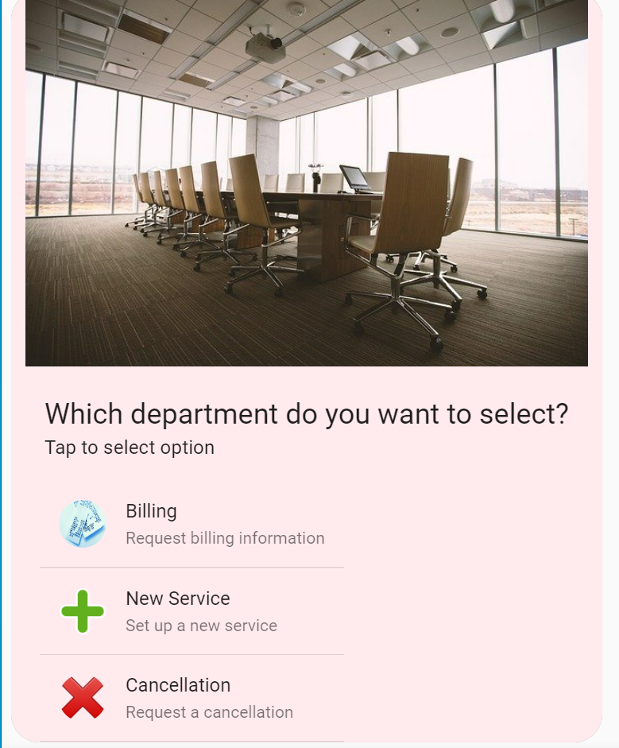
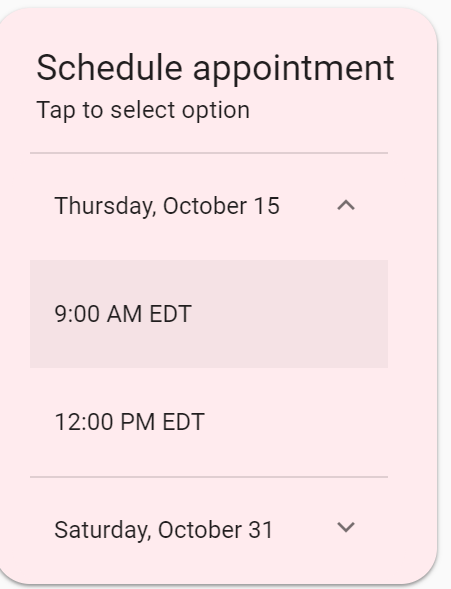
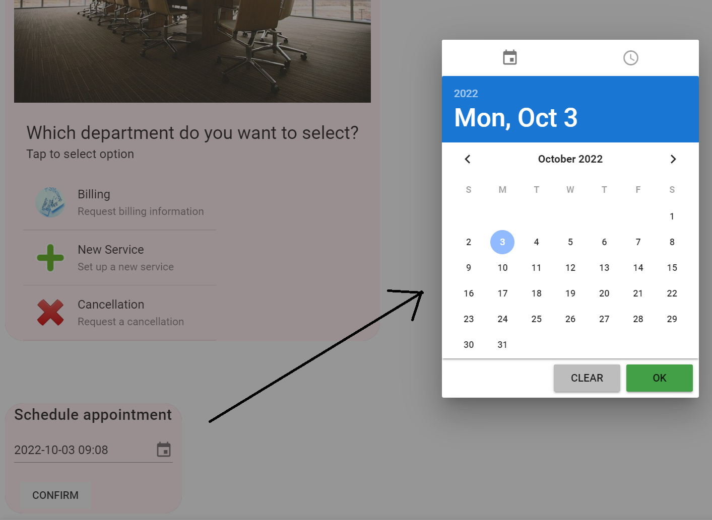
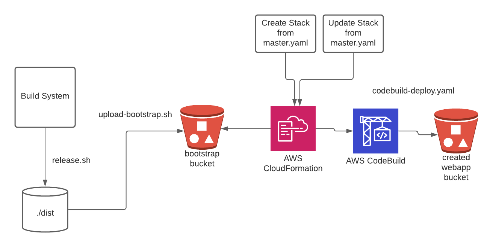
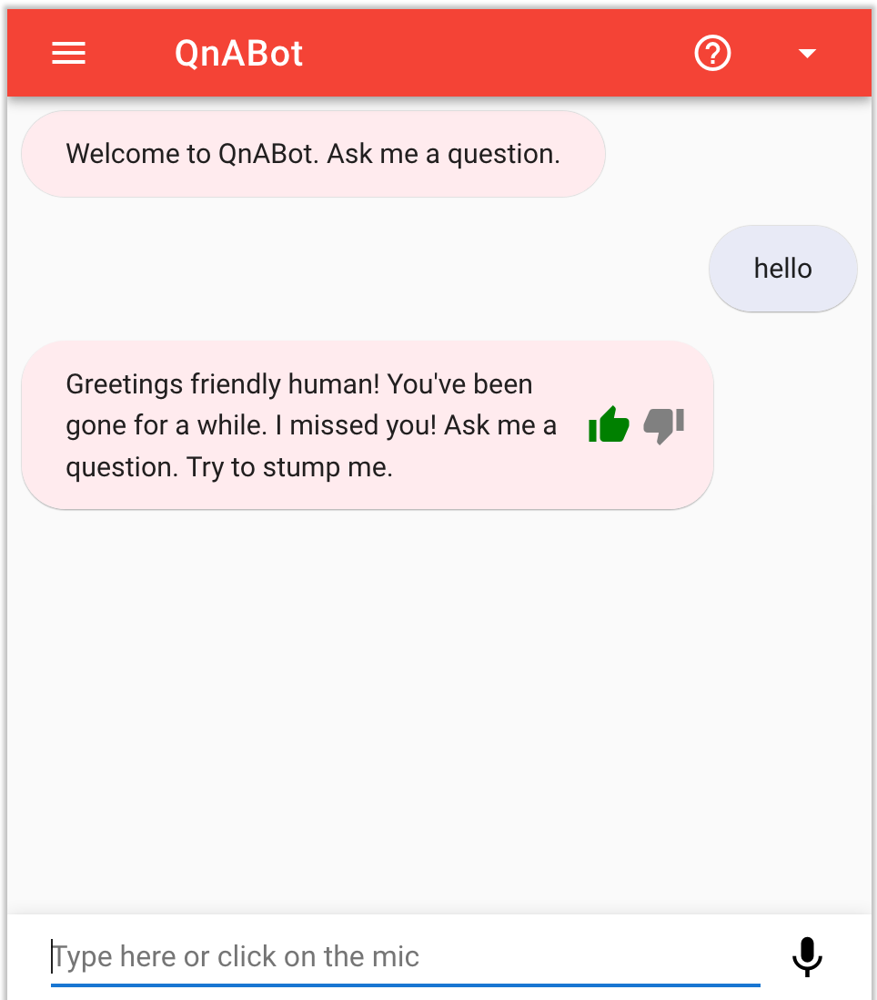
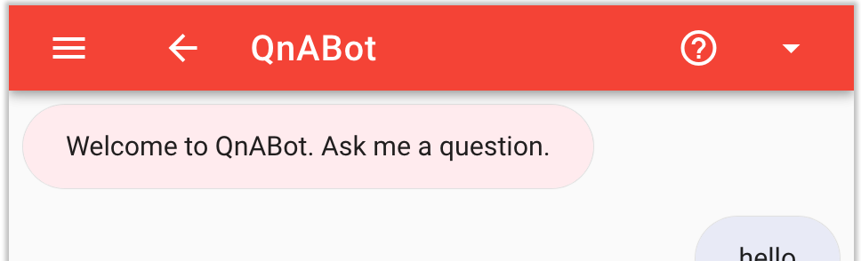

# Sample Amazon Lex Web Interface

# Overview
This is a sample [Amazon Lex](https://aws.amazon.com/lex/)
web interface. It provides a chatbot UI component that can be integrated
in your website. The interface allows a user to interact with a Lex bot directly
from a browser using text or voice.

It can be used as a full page chatbot UI:


Or embedded into an existing site as a chatbot widget:


### Features
- Mobile ready responsive UI with full page or embeddable widget modes
- Support for voice and text with the ability to seamless switch from
one mode to the other
- Voice support provides automatic silence detection, transcriptions
and ability to interrupt responses and replay recordings
- Display of Lex response cards
- Ability to programmatically configure and interact with the chatbot
UI using JavaScript
- [Connect interactive messaging](https://docs.aws.amazon.com/connect/latest/adminguide/interactive-messages.html) support

# Getting Started
The easiest way to test drive the chatbot UI is to deploy it using the
[AWS CloudFormation](https://aws.amazon.com/cloudformation/) templates
provided by this project. Once you have launched the CloudFormation stack,
you will get a fully working demo site hosted in your account.


These are the currently supported regions. Click a button to launch it in the desired region.

| Region   |  Launch | CloudFormation Template|
|----------|:-------------:|------------------|
| Northern Virginia | <a target="_blank" href="https://us-east-1.console.aws.amazon.com/cloudformation/home?region=us-east-1#/stacks/create/review?templateURL=https://s3.amazonaws.com/aws-bigdata-blog/artifacts/aws-lex-web-ui/artifacts/templates/master.yaml&stackName=lex-web-ui&param_BootstrapBucket=aws-bigdata-blog"><span></span></a>     |[us-east-1](https://aws-bigdata-blog.s3.amazonaws.com/artifacts/aws-lex-web-ui/artifacts/templates/master.yaml)|
| Oregon | <a target="_blank" href="https://us-west-2.console.aws.amazon.com/cloudformation/home?region=us-west-2#/stacks/create/review?templateURL=https://s3.amazonaws.com/aws-bigdata-blog-replica-us-west-2/artifacts/aws-lex-web-ui/artifacts/templates/master.yaml&stackName=lex-web-ui&param_BootstrapBucket=aws-bigdata-blog-replica-us-west-2"><span></span></a> |[us-west-2](https://aws-bigdata-blog-replica-us-west-2.s3-us-west-2.amazonaws.com/artifacts/aws-lex-web-ui/artifacts/templates/master.yaml)|
| Ireland | <a target="_blank" href="https://eu-west-1.console.aws.amazon.com/cloudformation/home?region=eu-west-1#/stacks/create/review?templateURL=https://s3.amazonaws.com/aws-bigdata-blog-replica-eu-west-1/artifacts/aws-lex-web-ui/artifacts/templates/master.yaml&stackName=lex-web-ui&param_BootstrapBucket=aws-bigdata-blog-replica-eu-west-1"><span></span></a> |[eu-west-1](https://aws-bigdata-blog-replica-eu-west-1.s3-eu-west-1.amazonaws.com/artifacts/aws-lex-web-ui/artifacts/templates/master.yaml)|
| Sydney | <a target="_blank" href="https://ap-southeast-2.console.aws.amazon.com/cloudformation/home?region=ap-southeast-2#/stacks/create/review?templateURL=https://s3.amazonaws.com/aws-bigdata-blog-replica-ap-southeast-2/artifacts/aws-lex-web-ui/artifacts/templates/master.yaml&stackName=lex-web-ui&param_BootstrapBucket=aws-bigdata-blog-replica-ap-southeast-2"><span></span></a> |[ap-southeast-2](https://aws-bigdata-blog-replica-ap-southeast-2.s3-ap-southeast-2.amazonaws.com/artifacts/aws-lex-web-ui/artifacts/templates/master.yaml)|
| Singapore | <a target="_blank" href="https://ap-southeast-1.console.aws.amazon.com/cloudformation/home?region=ap-southeast-1#/stacks/create/review?templateURL=https://s3.amazonaws.com/aws-bigdata-blog-replica-ap-southeast-1a/artifacts/aws-lex-web-ui/artifacts/templates/master.yaml&stackName=lex-web-ui&param_BootstrapBucket=aws-bigdata-blog-replica-ap-southeast-1a"><span></span></a> |[ap-southeast-1a](https://aws-bigdata-blog-replica-ap-southeast-1a.s3-ap-southeast-1.amazonaws.com/artifacts/aws-lex-web-ui/artifacts/templates/master.yaml)|
| Seoul | <a target="_blank" href="https://ap-northeast-2.console.aws.amazon.com/cloudformation/home?region=ap-northeast-2#/stacks/create/review?templateURL=https://s3.amazonaws.com/aws-bigdata-blog-replica-ap-northeast-2/artifacts/aws-lex-web-ui/artifacts/templates/master.yaml&stackName=lex-web-ui&param_BootstrapBucket=aws-bigdata-blog-replica-ap-northeast-2"><span></span></a> |[ap-northeast-2](https://aws-bigdata-blog-replica-ap-northeast-2.s3-ap-northeast-2.amazonaws.com/artifacts/aws-lex-web-ui/artifacts/templates/master.yaml)|
| London | <a target="_blank" href="https://eu-west-2.console.aws.amazon.com/cloudformation/home?region=eu-west-2#/stacks/create/review?templateURL=https://s3.amazonaws.com/aws-bigdata-blog-replica-eu-west-2/artifacts/aws-lex-web-ui/artifacts/templates/master.yaml&stackName=lex-web-ui&param_BootstrapBucket=aws-bigdata-blog-replica-eu-west-2"><span></span></a> |[eu-west-2](https://aws-bigdata-blog-replica-eu-west-2.s3.eu-west-2.amazonaws.com/artifacts/aws-lex-web-ui/artifacts/templates/master.yaml)|
| Tokyo | <a target="_blank" href="https://ap-northeast-1.console.aws.amazon.com/cloudformation/home?region=ap-northeast-1#/stacks/create/review?templateURL=https://s3.amazonaws.com/aws-bigdata-blog-replica-ap-northeast-1/artifacts/aws-lex-web-ui/artifacts/templates/master.yaml&stackName=lex-web-ui&param_BootstrapBucket=aws-bigdata-blog-replica-ap-northeast-1"><span></span></a> |[ap-northeast-1](https://aws-bigdata-blog-replica-ap-northeast-1.s3-ap-northeast-1.amazonaws.com/artifacts/aws-lex-web-ui/artifacts/templates/master.yaml)|
| Frankfurt | <a target="_blank" href="https://eu-central-1.console.aws.amazon.com/cloudformation/home?region=eu-central-1#/stacks/create/review?templateURL=https://s3.amazonaws.com/aws-bigdata-blog-replica-eu-central-1/artifacts/aws-lex-web-ui/artifacts/templates/master.yaml&stackName=lex-web-ui&param_BootstrapBucket=aws-bigdata-blog-replica-eu-central-1"><span></span></a> |[eu-central-1](https://aws-bigdata-blog-replica-eu-central-1.s3.eu-central-1.amazonaws.com/artifacts/aws-lex-web-ui/artifacts/templates/master.yaml)|
| Canada (Central) | <a target="_blank" href="https://ca-central-1.console.aws.amazon.com/cloudformation/home?region=ca-central-1#/stacks/create/review?templateURL=https://s3.amazonaws.com/aws-bigdata-blog-replica-ca-central-1/artifacts/aws-lex-web-ui/artifacts/templates/master.yaml&stackName=lex-web-ui&param_BootstrapBucket=aws-bigdata-blog-replica-ca-central-1"><span></span></a> |[ca-central-1](https://aws-bigdata-blog-replica-ca-central-1.s3.ca-central-1.amazonaws.com/artifacts/aws-lex-web-ui/artifacts/templates/master.yaml)|

By default, the CloudFormation template
creates a sample Lex bot and a [Amazon Cognito Identity
Pool](http://docs.aws.amazon.com/cognito/latest/developerguide/identity-pools.html)
to get you started. It copies the chatbot UI web application to an
[Amazon S3](https://aws.amazon.com/s3/) bucket including a dynamically
created configuration file. The CloudFormation stack outputs links to
the demo and related configuration once deployed. See the [CloudFormation
Deployment](#cloudformation-deployment) section for details.

You can modify the configuration of the deployed demo site to customize
the chatbot UI. It can also be further configured to be embedded it on
your web site. See the sections below for code samples and a description
of the configuration and deployment options.

*New regions supporting Lex only support Lex Version 2. A default install of Lex Web Ui with no target Bot specified
attempts to install a sample Lex Version 1 Bot and will fail in these new regions. In regions adding Lex support, a Lex Version 2 
Bot should be deployed prior to deploying Lex Web UI.*

# Integrating into your Site and Deploying
In addition to the CloudFormation deployment mentioned above, there are
other methods to integrate and deploy this project. Here is a summary
of the various methods:

| # | Method | Description | Use Case |
| --- | --- | --- | --- |
| 1 | [CloudFormation Deployment](#cloudformation-deployment) using the CloudFormation [templates](templates) provided by this project | Fully automated deployment of a hosted web application to an S3 bucket with an optional CI/CD pipeline. By default, it also creates a Cognito Identity Pool and a sample Lex bot | Use when you want to have a infrastructure as code approach that automatically builds and configures the chatbot UI resources |
| 2 | Use the pre-built [libraries](#libraries) from the [dist](dist) directory of this repo | We provide a pre-built version of the chatbot UI component and a loader library that you can use on your web site as a [stand alone page](#stand-alone-page) or as an embeddable [iframe](#iframe) | Use when you have an existing site and want to add the chatbot UI to it by simply copying or referencing the library files |
| 3 | Use npm to install and use the chatbot UI as a Vue component | Enables developers to consume this project as an [npm](https://www.npmjs.com/) package that provides a [Vue](https://vuejs.org/) component. See the [Npm Install and Vue Component Use](#npm-install-and-vue-component-use) section for details | Use when developing front-end based web applications built using JavaScript and bundled with tools such as [webpack](https://webpack.github.io) |

See the [Usage](#usage) and [Deployment](#deployment) sections below for details.

# Usage
This project provides a set of JavaScript libraries used to dynamically
insert the chatbot UI in a web page. The chatbot UI is loaded and
customized by including these libraries in your code and calling their
functions with configuration parameters.

The chatbot UI can be displayed either as a full page or embedded
in an iframe. In this section, you will find a brief overview of
the libraries and configuration parameters. It is useful to get
familiar with the concepts described in the [Libraries](#libraries)
and [Configuration](#configuration) sections before jumping to the code
[examples](#examples).

## Libraries
The list below describes the libraries produced by this project.
Pre-built versions of the libraries are found under the [dist](/dist)
directory of this repository.

1. **Chatbot UI component**. A UI widget packaged as a JavaScript reusable
component that can be plugged in a web application. The library is
provided by the `lex-web-ui.js` file under the [dist](dist) directory. It
is bundled from the source under the [lex-web-ui](lex-web-ui)
directory. This library is geared to be used as an import in a webpack
based web application but can also be instantiated directly in a web page
provided that you manually load the dependencies and explicitly pass
the configuration. See the component's [README](lex-web-ui/README.md)
for details
2. **Loader**. A script that adds the chatbot UI component library
described in the item above to a web page. It facilitates the
configuration and dependency loading process. The library
is provided by the `lex-web-ui-loader.js` file under the
[dist](dist) directory. It is bundled from the sources under the
[src/lex-web-ui-loader](src/lex-web-ui-loader) directory. This library
is used by adding a few script tags to an HTML page. See the loader
[README](src/README.md) for details

## Configuration
The chatbot UI component requires a configuration object
pointing to an existing Lex bot and to an [Amazon Cognito Identity
Pool](http://docs.aws.amazon.com/cognito/latest/developerguide/identity-pools.html)
to create credentials used to authenticate the Lex API calls from the
browser. The configuration object is also used to customize its behavior
and UI elements of the chatbot UI component.

The CloudFormation deployment method, from this project,
help with building a base configuration file. When deploying with it,
the base configuration is automatically pointed to the the
resources created in the deployment (i.e. Lex and Cognito).

You can override the configuration at run time by passing
parameters to the library functions or using various dynamic
configuration methods provided by the loader library (e.g. JSON
file, events). For details, see the [ChatBot UI Configuration
Loading](/src/README.md#chatbot-ui-configuration-loading) section
of the loader library documentation and the [Configuration and
Customization](/lex-web-ui/README.#configuration-and-customization)
section of the chatbot UI component documentation.

### Connect Interactive Messaging

Lex Web UI supports both [ListPicker and TimePicker templateTypes](https://docs.aws.amazon.com/connect/latest/adminguide/interactive-messages.html) and can be sent using the same JSON structure as utilized by Connect. 

ListPicker display in Web UI:



TimePicker in Web UI:



Additionally, Lex Web UI supports a DateTimePicker templateType which will give the end user an open-ended selector for a date/time variable to send back to Lex. DateTimePicker format expected:

```
{
   "templateType":"TimePicker",                                 (mandatory)
   "version":"1.0",                                             (mandatory)
   "data":{                                                     (mandatory)
      "content":{                                               (mandatory)
         "title":"Schedule appointment",                       (mandatory)
      }
   }
} 
```

DateTimePicker  in Web UI:



## Examples
The examples below are organized around the following use cases:
1. [Stand-Alone Page](#stand-alone-page)
2. [Iframe](#iframe)
3. [Npm Install and Vue Component Use](#npm-install-and-vue-component-use)

### Stand-Alone Page
To render the chatbot UI as a stand-alone full page, you can use two
alternatives: 1) directly use the chatbot UI component library or 2)
use the loader library. These libraries (see [Libraries](#libraries))
provide pre-built JavaScript and CSS files that are ready to be included
directly into an HTML file to display a full page chatbot UI.

When you use the chatbot UI component directly, you have to manually
load the component's dependencies and provide its configuration as a
parameter. The loader library alternative provides more configuration
options and automates the process of loading dependencies. It encapsulates
the chatbot UI component in an automated load process.

#### Stand-Alone Page Using the Loader Library
The loader library provides the easiest way to display the chatbot UI. The
entry point to this library is the `lex-web-ui-loader.js` script. This
script facilitates the process of loading run-time dependencies and
configuration.

If you deploy using the CloudFormation method, you will
get an S3 bucket with the loader library script and related files in a
way that is ready to be used. Alternatively, you can copy the files from
the `dist` directory of this repository to your web server and include the
loader.

In its most simple setup, you can use the loader library like this:
```html
<!-- include the loader library script -->
<script src="./lex-web-ui-loader.js"></script>
<script>
  /*
    The loader library creates a global object named ChatBotUiLoader
    It includes the FullPageLoader constructor
    An instance of FullPageLoader has the load function which kicks off
    the load process
  */

  // The following statement instantiate FullPageLoader and
  // calls the load function.
  // It is assumed that the configuration is present in the
  // default JSON file: ./lex-web-ui-loader-config.json
  new ChatBotUiLoader.FullPageLoader().load();
</script>
```

#### Stand-Alone API through the Loader Library

Similar to the iFrame loading technique described later, the
FullPageComponentLoader now provides an API allowing a subset of
events to be sent to the Lex Web UI Component. These events are
ping and postText. See the [full page](src/README.md#full-page) for
description of this API.

#### Stand-Alone details

For more details and other code examples about using the loader script
in a full page setup, see the [full page](src/README.md#full-page)
section of the loader documentation. You can also see the source of the
[index.html](src/website/index.html) page used in the demo site.

#### Stand-Alone Page Directly Using the ChatBot UI Component
Directly loading the chatbot UI component works at a lower level than
using the loader library as described above. This approach can be used
if you want to manually control the rendering, configuration and
dependency loading process.

The entry point to the chatbot UI component is the `lex-web-ui.js`
JavaScript file. The UI CSS styles are contained in the `lex-web-ui.css`
file. The component depends on the [Vue](https://vuejs.org/),
[Vuex](https://vuex.vuejs.org/), [Vuetify](https://vuetifyjs.com/)
and [AWS SDK](https://aws.amazon.com/sdk-for-browser/) libraries. You
should either host these dependencies on your site or load them from a
third-party CDN.

The HTML code below is an illustration of directly loading the chatbot UI
library and its dependencies.

**NOTE**: The versions of the links below may need to be pointed
to the latest supported versions.

```html
<html>
  <head>
    <!-- Font Dependencies -->
    <link href="https://fonts.googleapis.com/css?family=Roboto:300,400,500,700|Material+Icons" rel="stylesheet" type="text/css">

    <!-- Vuetify CSS Dependencies -->
    <link href="https://unpkg.com/vuetify@0.16.9/dist/vuetify.min.css" rel="stylesheet" type="text/css">

    <!-- LexWebUi CSS from dist directory -->
    <link href="./lex-web-ui.css" rel="stylesheet" type="text/css">
    <!-- page specific LexWebUi styling -->
    <style type="text/css">
      #lex-web-ui-app { display: flex; height: 100%; width: 100%; }
      body, html { overflow-y: auto; overflow-x: hidden; }
    </style>
  </head>
  <body>
    <!-- application will be dynamically mounted here -->
    <div id="lex-web-ui"></div>

    <!--
      Vue, Vuex, Vuetifiy and AWS SDK dependencies must be loaded before lex-web-ui.js.
      Loading from third party CDN for quick testing
    -->
    <script src="https://unpkg.com/vue@2.5.3"></script>
    <script src="https://unpkg.com/vuex@3.0.1"></script>
    <script src="https://unpkg.com/vuetify@0.16.9"></script>
    <script src="https://sdk.amazonaws.com/js/aws-sdk-2.149.0.min.js"></script>

    <!-- LexWebUi Library from dist directory -->
    <script src="./lex-web-ui.js"></script>

    <!-- instantiate the web ui with a basic config -->
    <script>
      // LexWebUi supports numerous configuration options. Here
      // is an example using just a couple of the required options.
      var config = {
        cognito: {
          // Your Cognito Pool Id - this is required to provide AWS credentials
          poolId: '<your cognito pool id>'
        },
        lex: {
          // Lex Bot Name in your account
          botName: '<your lex bot name>'
        }
      };
      // load the LexWebUi component
      var lexWebUi = new LexWebUi.Loader(config);
      // instantiate Vue
      new Vue({
        el: '#lex-web-ui',
        store: lexWebUi.store,
        template: '<div id="lex-web-ui-app"><lex-web-ui/></div>',
      });
    </script>
  </body>
</html>
```
### Iframe
You can embed the chatbot UI into an existing page using an iframe.
This approach provides a self-contained widget that can interact with
the parent page hosting the iframe. The `lex-web-ui-loader.js` loader
library provides the functionality to add it as an iframe in a page.

This loader script dynamically creates the iframe tag and supports
passing asynchronous configuration using events and JSON files. It also
provides an API between the iframe and the parent page which can be used
to pass Lex state and other events. These features are detailed in the
[Iframe Embedding](src/README.md#iframe-embedding) section of the library.

The HTML code below is a basic example of a parent page that adds the
chatbot UI as an iframe. In this scenario, the libraries and related
files from the `dist` directory of this repo are hosted in the same
directory as the parent page.

Please note that the `loaderOptions` variable has an `iframeSrcPath`
field which defines the path to the full page chatbot UI. This variable
can be pointed to a page like the one described in the [stand-alone
page](#stand-alone-page) section.

```html
<html>
  <head>
    <title>My Parent Page</title>
  </head>
  <body>
    <h1>Welcome to my parent page</h1>
    <!-- loader script -->
    <script src="./lex-web-ui-loader.js"></script>
    <script>
      /*
        The loader library creates a global object named ChatBotUiLoader
        It includes the IframeLoader constructor
        An instance of IframeLoader has the load function which kicks off
        the load process
      */

      // options for the loader constructor
      var loaderOptions = {
        // you can put the chatbot UI config in a JSON file
        configUrl: './chatbot-ui-loader-config.json',

        // the full page chatbot UI that will be iframed
        iframeSrcPath: './chatbot-index.html#/?lexWebUiEmbed=true'
      };

      // The following statement instantiates the IframeLoader
      var iframeLoader = new ChatBotUiLoader.IframeLoader(loaderOptions);

      // chatbot UI config
      // The loader can also obtain these values from other sources such
      // as a JSON file or events. The configUrl variable in the
      // loaderOptions above can be used to put these config values in a file
      // instead of explicitly passing it as an argument.
      var chatbotUiConfig = {
        ui: {
          // origin of the parent site where you are including the chatbot UI
          // set to window.location.origin since hosting on same site
          parentOrigin: window.location.origin,
        },
        iframe: {
          // origin hosting the HTML file that will be embedded in the iframe
          // set to window.location.origin since hosting on same site
          iframeOrigin: window.location.origin,
        },
        cognito: {
          // Your Cognito Pool Id - this is required to provide AWS credentials
          poolId: '<your cognito pool id>'
        },
        connect: {
          contactFlowId : '<your contact flow id>',
          instanceId : '<your instance id>',
          apiGatewayEndpoint : '<your api gateway endpoint>',
        },
        lex: {
          // Lex Bot Name in your account
          botName: '<your lex bot name>'
        }
      };

      // Call the load function which returns a promise that is resolved
      // once the component is loaded or is rejected if there is an error
      iframeLoader.load(chatbotUiConfig)
        .then(function () {
          console.log('iframe loaded');
        })
        .catch(function (err) {
          console.error(err);
        });
    </script>
  </body>
</html>
```
For more examples showing how to include the chatbot UI as an iframe,
see the source of the [parent.html](src/website/parent.html) page and the
[Iframe Embedding](src/README.md#iframe-embedding) documentation of the
loader library.

### Npm Install and Vue Component Use
You can use the [npm](https://docs.npmjs.com/) package manager to
install this project. The npm installation provides a library that you
can import as a module into your JavaScript code. The component is built
as a reusable [Vue](https://vuejs.org/) plugin. This approach is geared
to be used in a [webpack](https://webpack.github.io) based project.

Package installation using `npm`:

```shell
# install npm package from github repo
npm install --save awslabs/aws-lex-web-ui
# you may need to install co-dependencies:
npm install --save vue vuex vuetify material-design-icons roboto-fontface
```

This is a quick example showing how to import the library in your project:

```JavaScript
// assumes that a bundler like webpack will handle import/require
// using es6 module
import LexWebUi from 'aws-lex-web-ui';
// or using require
var LexWebUi = require('aws-lex-web-ui');
// import the debug non-minimized version
import LexWebUi from 'aws-lex-web-ui/dist/lex-web-ui';
```

The source of the chatbot UI component resides under the
[lex-web-ui](lex-web-ui) directory. For further details about the chatbot
UI component see its [README](lex-web-ui/README.md) file.

### Sample Site
This repository provides a sample site that you can use as a base
for development. The site is a couple of HTML pages can be found
in the [src/website](src/website) directory. The pages includes the
[index.html](src/website/index.html) file which loads the chatbot UI
in a stand-alone page and the [parent.html](src/website/parent.html)
which page loads the chatbot UI in an iframe.

These pages are the same ones that are deployed by the CloudFormation
deployment method in this project. It uses the
`lex-web-ui-loader.js` loader library to display and configure the chatbot
UI. You can run a development version of this sample site on your machine.

#### Running Locally
This project provides a simple HTTP server to serve the sample site.
You can run the server using [Node.js](https://nodejs.org) on your local
machine or a test server.

The chatbot UI requires proper configuration values in the files located
under the [src/config](src/config) directory. Modify the values in the
`lex-web-ui-loader-config.json` file under the `src/config` directory.
If you deployed the demo site using the CloudFormation templates provided
by this project, you can copy the automatically generated config files
from the S3 buckets to your development host.

As a minimum,you would need to pass an existing Cognito Pool Id
and Lex Bot name. For example, set the appropriate values in the
`src/config/lex-web-ui-loader-config.json` file:
```JSON
  ...
  cognito: {
    "poolId": "us-east-1:deadbeef-fade-babe-cafe-0123456789ab"
  },
  lex: {
    "botName": "myHelpBot"
  }
  ...
```

Before you run the local development server, you need to install the
development dependencies with the command:
```shell
npm install
```
To start the HTTP server web on port `8000`, issue the command:
```shell
# serves http://localhost:8000/index.html
# and http://localhost:8000/parent.html
npm start
```

If you want to hack the libraries under the `src/lex-web-ui-loader`
directory, the project provides a hot reloadable [webpack dev
server](https://github.com/webpack/webpack-dev-server) setup with the
following command:
```shell
# runs on port 8000
npm run dev
```

For a more advanced local host development and test environment, see the
[Dependencies and Build Setup](lex-web-ui#dependencies-and-build-setup)
documentation of the chatbot UI component.

# Deploying
This project provides [AWS CloudFormation](https://aws.amazon.com/cloudformation/)
templates that can be used to launch a fully configured working demo site and
related resources (e.g. Lex bot and Cognito Identity Pool).

The CloudFormation deployment is the preferred method as it allows to
automatically build, configure and deploy the application (including an
optional CI/CD pipeline) and it provides a higher degree of flexibility
when integrating with an existing environment.

## CloudFormation Deployment
The CloudFormation stack creates a web app in an S3 bucket which you
can link from your site. The S3 bucket also hosts the configuration,
JavaScript and CSS files which can be loaded by your existing web
pages. The CloudFormation deployment is documented in the
[README](templates/README.md) file under the [templates](templates)
directory.

## Building and Deploying your own LexWebUi

If you want to modify or change LexWebUi functionality follow this
release process once you are satisfied and have tested your code modifications. 
You'll need to create an S3 bucket to hold the bootstrap artifacts. Replace "yourbootstrapbucketname" with
the name of your bucket to complete the upload. 

```
npm install
cd lex-web-ui
npm install
cd ../build
./release.sh
export BUCKET="yourbootstrapbucketname"
./upload-bootstrap.sh
```

Note that "yourbootstrapbucket" (S3 bucket) must allow objects with public-read acl to be added. This approach
is described in the image below.

Once you've uploaded your distribution to your own bootstrap bucket, you can launch an installation of LexWebUi 
in the AWS region where this bucket is located by using the master.yaml from your bootstrap bucket. You can 
also update an existing LexWebUi installation by performing a stack update replacing the current template with
the template you just uploaded to your bootstrap bucket. Note that for either a fresh installation or an update,
you need to change the BootstrapBucket parameter to be the name of your bootstrap bucket and the BootstrapPrefix
parameter to be just "artifacts".



# New Features

### Changes in version 0.19.0
Two changes in version 0.19.0 are the ability to forward chat history as a transcript to an
agent when Connect Live Chat is initiated. Details on use of the transcript can be found in
[Connect Live Chat Agent Readme](README-connect-live-chat.md). This version also updates the 
OPTIONS method in the API to configure CORS to only allow requests from the WebAppParentOrigin. 

### Changes in version 0.18.2
Add feature for connect live chat. Allow client to optionally interact with an agent via Connect.
See [Connect Live Chat Agent Readme](README-connect-live-chat.md) for additional details.

### Notable changes in version 0.18.1
The Lex Web Ui now supports configuration of multiple Lex V2 Bot Locale IDs
using a comma separated list in the parameter LexV2BotLocaleId. The default Locale ID 
is en_US. Other supported values are de_DE, en_AU, en_GB, es_419, es_ES, es_US, fr_CA, 
fr_FR, it_IT, and ja_JP. See "https://docs.aws.amazon.com/lexv2/latest/dg/lex2.0.pdf" 
for the current list of supported Locale IDs. 

When multiple Locale IDs are specified in LexV2BotLocaleId, the Lex Web UI toolbar menu 
will allow the user to select the locale to use. The user selected locale ID is 
preserved across page refreshes. The locale selection menu items will be disabled if 
the user is the middle of completing an intent as the locale ID can't be changed at this 
time. The selected locale ID will be displayed in the toolbar. 

Lex Web Ui is now available in the Canada (Central) region - ca-central-1

For a complete list of fixes/changes in this version see CHANGELOG.md.

### Fixes/changes in version 0.18.0
- Move from webpack V3 to webpack V4 in the lex-web-ui component.
- Move to npm version 7.10.0.  
- Update component package versions.
- Resolve dependabot alerts.
- Fix to resolve update problem where Cognito Supported Identity Providers is reset to just Cognito. An update 
  will now preserve the existing Supported Identity Providers.
- Set AWS sdk to version 2.875.0.
- Improve Lex V2 support to handle responseCard defined as a session attribute in sessionAttributes.appContext.responseCard.
- Removed support for AWS Mobile Hub based distribution.

### Fixes/changes in version 0.17.9
- New support for Lex Version 2 Bots - added template parameters for V2 Bot Id, Bot Alias Id,
  and Locale Id. When a V1 Bot name is provided, the template will configure resources to use
  the V1 bot. When the V1 Bot name is left empty and the V2 Bot parameters are specified, the template
  will configure resources to use the V2 Bot. V1 Bot parameters take precedence over V2 Bot parameters if both
  are supplied.
- The Lex Web Ui can now be configured to send an initial utterance to the bot to get an intent started. A
  new template parameter named WebAppConfBotInitialUtterance is available. If left empty, no initial utterance is
  sent to the Bot which is the default behavior.
- Changed format of the date message displayed on a message to use "n min ago" to assist with accessibility when
  displaying this value.
- Changed behavior of ShouldLoadIframeMinimized setting. In prior releases, the last known state of the iframe took priority
  over this setting. In this release, when ShouldLoadIframeMinimized is set to true and the parent page is
  loaded or refreshed, the Bot iframe will always appear minimized. If this parameter is set to false, the last known state
  of the Bot is used to either show the iframe or minimize the iframe.
- Changed loginutils.js to prevent the parent page or the full page from looping if login fails through cognito.
  With this change, up to 5 attempts will be performed before failing with an alert message presented to the user.
- Support mixed case web ParentOrigin URLs and WebAppPath in Cognito user pool to prevent login failures due to case mismatch.
- Support multiple values for WebAppPath. This allows the LexWebUI with login enabled to be deployed on multiple pages
  on the same site (origin).
- Update the Cognito Callback and Signout URLs in the Cognito UserPool when ParentPageOrigin and WebAppPath parameters
  are updated in CloudFormation.

### Fixes in version 0.17.8
- Fix for pipeline based deployments - issue 264 - template error
- Fix to full page web client (index.html) using forceLogin to require a redirect to login page
- Fix to move to python 3.8 Lambda Runtime for yaml CloudFormation template embedded functions which remove use of boto3 vendored library
- Add ability for Lex Web UI to automatically retry a request if the Lex bot times out after 30 seconds using a configurable number of attempts.
  By default the timeout retry feature is disabled. When enabled, the default retry count is 1.

### Fixes in version 0.17.7
- Build script fix
- Move min button icon to the left of text

### Fixes in version 0.17.6
- Additional fixes to support upgrades. Upgrades from 0.17.1 and above are supported.
  Older versions will need to perform a fresh install to migrate to this version.

### Fixes in version 0.17.5
- Fix to allow use of CF template upgrade to disable WebAppConfHelp, WebAppConfPositiveFeedback, and WebAppConfNegativeFeedback
- Fix to improve resizing of lex-web-ui button at bottom of page when text is used in addition to icon

### Features in version 0.17.4
- Improved upgrade support.
  * The CloudFormation upgrade stack operation from the AWS Console should now be used to
    change configuration using the available parameters. After the upgrade is complete, the
    lex-web-ui-loader-config.json file deployed to the web app S3 bucket will be updated
    with the values specified in the template. Prior versions of the config file are archived
    using a date timestamp in the S3 bucket should you need to refer to prior configuration values.
  * Users can now upgrade to new versions of Lex-Web-Ui using the AWS CloudFormation console
    by replacing the template and specifying the S3 template location from the original regional
    S3 bucket. As new releases of Lex-Web-Ui are published to the distribution repositories, you
    can now upgrade to this version using the CloudFormation Upgrade/replace template process.
  * After an upgrade, the CloudFront distribution cache will need to be invalidated for the changes to be seen
    immediately.
- Chat history can now be preserved and redisplayed when the user comes back to the original parent page
  hosting the Lex-Web-Ui. This features is controlled using the SaveHistory template parameter. When
  this feature is enabled, a new menu is visible in the user interface that allows the user to
  clear chat history. The following are the methods you can enable this feature. Note that you can
  toggle this feature on and off using the upgrade process.
  * During a new deployment, specify true for the Save History parameter
  * Using the new upgrade feature, specify true for Save History parameter in the CloudFormation
  console.
- Lambda function upgrade to Python 3.7.

### Fixes in version 0.17.3
- Added loader config option (forceLogin) to templates which configures UI to require the user to authenticate through Cognito prior to using the bot.
- Added loader config option (minButtonContent) which allows text to be added to the button which appears on the parent page when the iframe is minimized.
- Added XRay support to Lambda functions.
- Added VPC actions to Lambda IAM Roles to support future deployment of Lambdas in VPC.
- Encrypted S3 buckets using AES-256 default KMS key
- Prebuilt deployments now available for Singapore, Tokyo, London, and Frankfurt regions

### Fixes in version 0.17.2
- Added option to hide message bubble on button click
- Resolved current github dependabot security issues
- Use default encryption for all S3 buckets using AES-256 encryption
- Added instructions in readme for adding additional vue components

### Fixes in version 0.17.1
- Create uniquely named Cognito UserPool on stack creation
- Removed display of Back button in title bar and instead provide a replay button using the text from prior
message directly in the message bubble. Back button can be re-enabled though configuration json if desired.
- Enhanced css attributes of the minimized chatbot button to help allow clicking on items in the parent
window as well as selecting text next the button.

### New Features in version 0.17.0
- Improved screen reader / accessibility features
- Added CloudFormation stack outputs for CloudFront and S3 bucket
- Use response card defined in session attribute "appContext" over that defined by Lex based response Card
- lex web ui now supports greater than 5 buttons when response card is defined in session attributes "appcontext"
- Updated dependent packages in package-lock.json identified by Dependabot security alerts
- Resolved additional CloudFront CORS issues
- See [CHANGELOG](CHANGELOG.md) for additional details

### New Features in version 0.16.0
- Lex-web-ui now ships with cloudfront as the default distribution method
  * better load times
  * non public access to S3 bucket
  * better future integration to cloudfront features such as WAF and Lambda@Edge
- Updated package.json dependencies

### New Features in version 0.15.0
- Moved to Webpack 4
- Changed default parameter ShowResponseCardTitle to be false - was default of true
- Added back default parameter BotAlias of '$LATEST'. The '$LATEST'
alias should only be used for manual testing. Amazon Lex limits
the number of runtime requests that you can make to the $LATEST version of the bot.



Toolbar Buttons

- Help Button
</br>
Sends a help message to the bot
- Back Button
</br>
Resends the previous message
