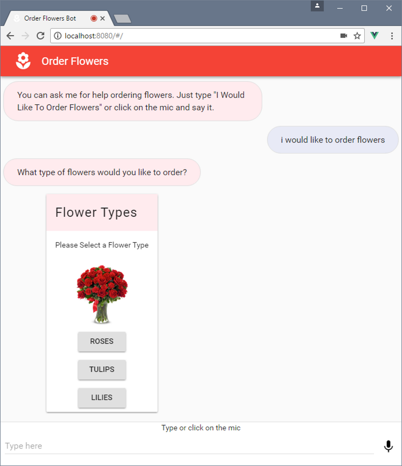

# Sample Lex Web Interface

## Overview
This repository provides a set of
[AWS CloudFormation](https://aws.amazon.com/cloudformation/) templates to
automatically build and deploy a sample
[Amazon Lex](https://aws.amazon.com/lex/)
web interface.

## Launching
1. Click this CloudFormation button to launch your own copy of the sample
application stack in the us-east-1 (N. Virginia) AWS region:
[](https://console.aws.amazon.com/cloudformation/home?region=us-east-1#/stacks/new?stackName=lex-web-ui&templateURL=https://s3.amazonaws.com/aws-bigdata-blog/artifacts/aws-lex-web-ui/artifacts/templates/master.yaml)
2. Create the `OrderFlowers` bot in your account by following the
instructions here:
[Create an Amazon Lex Bot (Console)](http://docs.aws.amazon.com/lex/latest/dg/gs-bp-create-bot.html)
If you already have the OrderFlowers bot in your account, you can skip
this step. The stack defaults to use this bot but you can also provide
a different bot name in the CloudFormation parameter or change it later.
3. Once the status of all the CloudFormation stacks is `CREATE_COMPLETE`,
click on the `PipelineUrl` link in the output section of the master
stack. This will take you to the CodePipeline console. You can monitor
the progress of the deployment pipeline from there. It takes up to 20
minutes to build and deploy the application.
4. Once the pipeline has deployed successfully, go back to the output section
of the master CloudFormation stack and click on the `ParentPageUrl` link. You
can also browse to the `WebAppUrl` link. Those links will take you to the
sample application running both as stand-alone and embedded in an iframe.

## CloudFormation Stack
### Diagram
Here is a diagram of the CloudFormation stack created by this project:


### CloudFormation Resources
The CloudFormation stack creates the following resources in your AWS account:

- A [Cognito Identity Pool](http://docs.aws.amazon.com/cognito/latest/developerguide/identity-pools.html)
used to pass temporary AWS credentials to the web app. You can optionally
pass the ID of an existing Cognito Identity Pool to avoid creating a
new one.
- A [CodeCommit](https://aws.amazon.com/codecommit/)
repository loaded with the source code in this project
- A continuous delivery pipeline using [CodePipeline](https://aws.amazon.com/codepipeline/)
and [CodeBuild](https://aws.amazon.com/codebuild/).
The pipeline automatically builds and deploys changes to the app committed
  to the CodeCommit repo.
- An [S3](https://aws.amazon.com/s3/) bucket to store build artifacts
- Two S3 buckets to host the web application (parent and iframe). The
  pipeline deploys to this bucket.
- [Lambda](https://aws.amazon.com/lambda/) functions used as CloudFormation
[Custom Resources](http://docs.aws.amazon.com/AWSCloudFormation/latest/UserGuide/template-custom-resources.html)
to facilitate custom provisioning logic
- [CloudWatch Logs](http://docs.aws.amazon.com/AmazonCloudWatch/latest/logs/WhatIsCloudWatchLogs.html)
groups automatically created to log the output of Lambda the functions
- Associated [IAM roles](http://docs.aws.amazon.com/IAM/latest/UserGuide/id_roles.html)
for all of the above

### CloudFormation Templates
The CloudFormation launch button above launches a master stack that in
turn creates various nested stacks. The following table lists the
CloudFormation templates used to create these stacks:

| Template | Description |
| --- | --- |
| [templates/master.yaml](templates/master.yaml) | This is the master template used to deploy all the stacks. It uses nested sub-templates to include the ones listed below. |
| [templates/cognito.yaml](templates/cognito.yaml) | Cognito Identity Pool and IAM role for unauthenticated identity access. |
| [templates/coderepo.yaml](templates/coderepo.yaml) | CodeCommit repo dynamically initialized with the files in this repo using CodeBuild and a custom resource. |
| [templates/pipeline.yaml](templates/pipeline.yaml) | Continuous deployment pipeline of the Lex Web UI Application using CodePipeline and CodeBuild. The pipeline takes the source from CodeCommit, builds the Lex web UI application using CodeBuild and deploys the app to an S3 bucket. |

### Parameters
When launching the stack, you will see a list of available parameters
and a brief explanation of each one. You can take the default values of
most of the CloudFormation parameters. The parameters that you may need
to modify are:

- `BotName`: Name of pre-existing Lex bot. Defaults to sample `OrderFlowers`
- `ParentOrigin`: [Origin](https://developer.mozilla.org/en-US/docs/Web/Security/Same-origin_policy)
  of the parent window. Only needed if you wish to embed the web app
  into an existing site using an iframe. The origin is used to control
  which sites can communicate with the iframe

### Output
Once the CloudFormation stack is successfully launched, the status of
all nested stacks will be in the `CREATE_COMPLETE` green status. At
this point, the master stack will reference the resources in the output
section. Here is a list of the output variables:

- `PipelineUrl`: Link to CodePipeline in the AWS console.  After the stack
is successfully launched, the pipeline automatically starts the build
and deployment process You can click on this link to monitor the pipeline.
- `CodeCommitRepoUrl`: CodeCommit repository clone URL. You can clone
the repo using this link and push changes to it to have the pipeline
build and deploy the web app
- `WebAppUrl`: URL of the web app running on a full page. The
web app will be available once the pipeline has completed deploying
- `ParentPageUrl`: URL of the web app running in an iframe. This is an
optional output that is returned only when the stack creates the sample
when page. It is not returned if an existing origin is passed as a
parameter to the stack during creation.
- `CognitoIdentityPoolId`: Pool ID of the Cognito Identity Pool created
by the stack. This is an optional output that is returned only when the
stack creates a Cognito Identity Pool. It is not returned if an existing
pool ID was passed as a parameter to the stack during creation.

## Deployment Pipeline
When the stacks have completed launching, you can see the status of
the pipeline as it builds and deploys the application. The link to the
pipeline in the AWS console can be found in the `PipelineUrl` output
variable of the master stack.

Once the pipeline successfully finishes deploying, you should be able to
browse to the web app. The web app URL can be found in the `WebAppUrl`
output variable.

The source of this project is automatically forked into a CodeCommit
repository created by the CloudFormation stack. Any changes pushed to
the master branch of this forked repo will automatically kick off the
pipeline which runs a CodeBuild job to build and deploy a new version
of the web app. You will need to
[setup](http://docs.aws.amazon.com/codecommit/latest/userguide/setting-up.html)
CodeCommit to push changes to this repo. You can obtain the CodeCommit
git clone URL from the `CodeCommitRepoUrl` output variable of the
master stack.

Here is a diagram of the DeploymentPipeline:


## Directory Structure
This project contains the following main directories:

```
 .
 |__ build                 # Makefile used for uploading the project sources into S3
 |__ lex-web-ui            # sample Lex web ui application source
 |__ templates             # cloudformation templates and related lambda functions
    |__ custom-resources   # lambda functions used in cfn custom resources
```

## Web UI Application
The sample chatbot web user interface can be used to interact with any
Lex bot using text or voice with any webRTC capable browser.

The interface interacts with AWS services directly from the browser. Here is
a diagram of how the application works:


For details about the web app, see the accompanying
[README](lex-web-ui/README.md) file and the source under the
[lex-web-ui](lex-web-ui) directory.

Here is a screenshot of it:


# How do I ...?

## Deploy Using My Own Bootstrap S3 Bucket
The source used to bootstrap the CodeCommit repo created by CloudFormation
is dynamically downloaded from a predefined S3 bucket. If you want
to use your own S3 bucket, this project provides a `Makefile` under the
`build` directory to facilitate uploading the bootstrap artifacts. Follow
these steps:

1. Create your own S3 bucket (you might want to enable
[bucket
versioning](http://docs.aws.amazon.com/AmazonS3/latest/dev/Versioning.html)
on this bucket).
2. Modify the [master.yaml](templates/master.yaml) template to point to
your bucket. The bucket and path are configured by the `BootstrapBucket`
and `BootstrapPrefix` variables under the `Mappings` section of the
template.
3. Modify the variables in the local build environment file:
[build/config.env](build/config.env). These variables control the build
environment and web application deployment. In specific, you should
modify the following variables:
     - `BOOTSTRAP_BUCKET_PATH`: point it to your own bucket and prefix
       merged together as the path to the artifacts (same as step 2)
4. Upload the files to your S3 bucket using `make upload`. The
[build](build) directory under the root of the repo contains a `Makefile`
that can be used to build the artifacts and upload the files to your S3
bucket. It uses the [aws cli](https://aws.amazon.com/cli/) to copy the
files to S3. To upload the files to your s3 bucket, issue the following
commands (from the root of the repository):
```shell
cd build
make upload # requires a properly configured aws cli installation
```

## Delete the CloudFormation stacks?
The resources created by this stack can be easily removed from your
account by deleting the master CloudFormation stack. The master stack
is the one that was first created using the "Launch Stack" button. By
deleting this stack, the rest of the sub-stacks and resources will be
deleted with the exception of the CloudWatch Logs groups created by the
stack (these are retained for troubleshooting purposes).

The S3 buckets created by the stacks are deleted by default. If you wish
to retain the data in these buckets, you should set the `CleanupBuckets`
parameter to false in the master stack.
