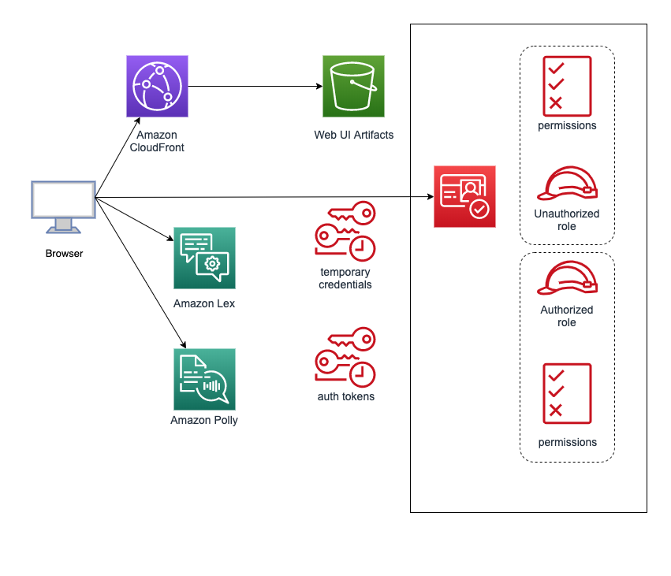

# Lex Chatbot Web Interface

> Sample Lex Chatbot Web Interface Application

## Overview
This application provides a sample chatbot web interface for [Amazon
Lex](https://aws.amazon.com/lex/). It is a responsive user interface that
can be run as a mobile friendly stand-alone web app or embedded into an
existing site using an iframe. The interface supports interacting with
Lex using text and voice.

## Application Architecture
The chatbot interface is a JavaScript driven web application.
It works by making calls to the Lex service directly from a
user's browser using temporary credentials obtained from [Amazon
Cognito](https://aws.amazon.com/cognito/). This allows the chatbot web app
to be served from S3 or CloudFront in a scalable serverless architecture.
Here is a diagram of how the application works:



### Dependencies
The chatbot web app is built using the [Vue.js](https://vuejs.org/)
JavaScript framework. The user interface is structured as modular
components using [Vuetify.js](https://vuetifyjs.com/). The application
state management is done using [Vuex](https://vuex.vuejs.org/en/). The
code base employs ECMAScript 6 (ES6) features such as modules, arrow
functions and classes to improve modularity and brevity.

### Library
The chatbot UI provides a library that can be used as a Vue plugin.
It adds a property named `$lexWebUi` to the Vue class and registers
a global Vue component name `LexWebUi`.

You can import the library as a module and use it in your code:
```
  // dependencies
  import Vue from 'vue';
  import Vuex from 'vuex';
  import Vuetify from 'vuetify';

  // import the component constructor
  import { Loader as LexWebUi } from 'aws-lex-web-ui';

  Vue.use(Vuetify);
  Vue.use(Vuex);

  // plugin creates the LexWebUi component
  const lexWebUi = new LexWebUi({
    // pass your own configuration
    cognito: {
      poolId: 'us-east-1:deadbeef-fade-babe-cafe-0123456789ab',
    },
    lex: {
      initialText: 'How can I help you?',
      botName: 'helpBot',
      botAlias: '$LATEST',
    },
    ui: {
      toolbarTitle: 'Help Bot',
      toolbarLogo: '',
    },
  });

  // instantiate Vue
  const vm = new Vue({
    el: '#lex-web-ui',
    // vuex store is in the lexWebUi instance
    store: lexWebUi.store,
    // you can use the global LexWebUi/<lex-web-ui> commponent in templates
    template: `
      <div id="lex-web-ui-app">
        <lex-web-ui
          v-on:updateLexState="onUpdateLexState"
        ></lex-web-ui>
      </div>`,
    methods: {
      onUpdateLexState(lexState) {
        // handle lex state change events
      },
    },
  });

  /*
  You will need to import the CSS depdendencies as well:

    @import 'node_modules/roboto-fontface/css/roboto/roboto-fontface.css';
    @import 'node_modules/material-design-icons/iconfont/material-icons.css';
    @import 'node_modules/vuetify/dist/vuetify.min.css';
    @import 'node_modules/aws-lex-web-ui/dist/lex-web-ui.css';
  */
```

Alternatively, for finer control, you can use the Vue plugin directly
in your application as show below. Note as of verion 0.14.5, the lexRuntimeClient will
be dynamically reinitialized using the region configured or specified in the cognito poolId. 
Make sure that the Cognito Identity Pool is provisioned in the same region as the LexBot.
Mixing regions is not supported.
```
  import Vue from 'vue';
  import Vuex from 'vuex';
  import Vuetify from 'vuetify';
  import { Config as AWSConfig, CognitoIdentityCredentials }
    from 'aws-sdk/global';
  import LexRuntime from 'aws-sdk/clients/lexruntime';
  import Polly from 'aws-sdk/clients/polly';

  import { Plugin as LexWebUi, Store as LexWebUiStore } from 'aws-lex-web-ui';

  Vue.use(Vuex);
  Vue.use(Vuetify);

  const poolId = 'us-east-1:deadbeef-cac0-babe-abcd-abcdef01234';
  const region = 'us-east-1';
  const credentials = new CognitoIdentityCredentials(
    { IdentityPoolId: poolId },
    { region },
  );
  const awsConfig = new AWSConfig({ region, credentials });
  const lexRuntimeClient = new LexRuntime(awsConfig);
  const pollyClient = new Polly(awsConfig);

  const store = new Vuex.Store(LexWebUiStore);

  // see the configuration section for details about the config fields
  const config = {
    cognito: { poolId },
    lex: { botName: 'MyBot', initialText: 'How can I help you?' },
    ui: { toolbarLogo: '', toolbarTitle: 'My Bot' },
  };

  Vue.use(LexWebUi, { config, awsConfig, lexRuntimeClient, pollyClient });

  /*
    You can now use the '<lex-web-ui>' tag in your Vue templates The
    'LexWebUi' component is global to the Vue instance. You can access
    the lexWebUi plugin instance in your components as 'this.$lexWebUi'.

    Make sure to add the 'store' variable as the vuex store to your Vue
    instance or component.

    The '<lex-web-ui>' component emits 'updateLexState' events everytime
    the Lex state changes. The parent component can handle these events
    using 'v-on' to grab the current Lex state.

    You will need to import CSS dependencies into your project:
    @import 'node_modules/roboto-fontface/css/roboto/roboto-fontface.css';
    @import 'node_modules/material-design-icons/iconfont/material-icons.css';
    @import 'node_modules/vuetify/dist/vuetify.min.css';
    @import 'node_modules/aws-lex-web-ui/dist/lex-web-ui.css';
  */
```

## Credential Management
This sample application uses [Amazon
Cognito](https://aws.amazon.com/cognito/) to provide temporary AWS
credentials for use with the Lex and Polly services. The sample application also
uses Cognito for user sign-up, sign-in, and access control when Cognito Login Support
is enabled. 

Amazon Cognito provides authentication, authorization, and user management for the sample
Lex Web Ui provided by this project. Users can sign in directly with a user name and 
password, or through a third party such as Facebook, Amazon, or Google depending on how
you ultimately configure use of Amazon Cognito.

The accompanying CloudFormation stack in this project, automatically
creates a
[Cognito Identity Pool](https://docs.aws.amazon.com/cognito/latest/developerguide/identity-pools.html)
for you.

You can optionally Authentication Providers such as Amazon, Google, Facebook by 
editing the Identity Pool configuration. Be sure to follow the guidelines for
each provider.

It is important to note that the CloudFormation stack **automatically creates** a
[Cognito User Pool](https://docs.aws.amazon.com/cognito/latest/developerguide/cognito-user-identity-pools.html)
for you as well and associates the user pool with the Cognito Identity Pool as an
Authentication Provider.

### Cognito Login Support ###

Since a Cognito User Pool is now created by default, you can easily enable Login in the
Lex Web UI. This can be enabled in one of two ways.

- During deployment of the CloudFormation template. Set the EnableCognitoLogin 
parameter to true.


- Post deployment by editing the lex-web-ui-loader-config.json file. Set the ui configuration
value 

```
"ui": {
    ...
    "enableLogin": true,
    ...
}

```

This enables the menu icon in the toolbar area with a single menu item that toggles 
between "Login" or "Logout" depending on whether the user has successfully logged in. 
In the default configuration, users can register a new account with the
Cognito User Pool and then sign-in from this user pool. The User Pool
should be customized going forward with appropriate images and 
styling to fit your web site.

Alternatively, if other social media sign-ins are enabled in the
IdentityPool, users can sign-in using these providers. 

Once signed in, three tokens are managed by the lex-web-ui and provided on requests
to Lex. These are the accesstoken, the idtoken, and a refreshtoken. These tokens 
are passed as Lex session attributes on each request to Lex.

Configured Fulfillment lambda handlers can utilize these
tokens by accessing them from session attributes. They can be used to
validate access or lookup attributes / assertions from the SSO provider. 

The session attributes are

* session.accesstokenjwt
* session.idtokenjwt
* session.refreshtokenjwt

The Lex Web UI initially will use the unauth role until a user logs in. 
After login processing fully completes, an event fires in the browser indicating tokens 
are now available. At that time, the Lex Web UI will switch to using auth based role by 
using new temporary credentials.

### Adjusting existing Identity Pools to be used with the lex-web-ui

If you want to manually use your own Cognito Identity Pool,
you will need to perform additional setup of resources or ensure the following 
resources have been defined and configured. 

The resources below are configured automatically by the
CloudFormation stack when a new identity pool is being created. They are not
provisioned when using an existing Identity Pool. 

#### Roles
Make sure two roles (Unauthenticated and Authenticated) are configured for the
IdentityPool. The Unauthenticated role should
allow access to the Lex PostText/PostContent API calls and Polly
SynthesizeSpeech. If Cognito Login is enabled for the Lex Web UI, the
Authenticated role should be created and should allow access to the 
Lex PostText/PostContent API actions and the Polly SynthesizeSpeech action. Other 
services and actions can be enabled as needed. 

#### Cognito User Pool

1. Make sure a Cognito User Pool is created. It should be defined with the following 
required attributes: given_name, family_name, preferred_username, and email.

* Note this is a ten step process to click through and build up a cognito user pool.
The configuration steps are highlighted in the [flow of configuration screens](./READMECONFIGSCREENS.md) using
the Amazon Cognito Console. 

2. A User Pool App Client should be created. 

The list of Enabled Identity Providers should include at least Cognito.

SignIn and Signout Providers will need to be defined but can only be filled in
once the lex-web-ui has been deployed. 

The callback URLs is the URL to your application. The sample pages using CloudFormation
setup are deployed to S3 however your setup may be different. The default scripts use
?loggedin=yes and ?loggedout=yes. These portions of the URL should not be modified

```
https://YOURS3BUCKET.s3.amazonaws.com/index.html?loggedin=yes, https://YOURS3BUCKET.s3.amazonaws.com/parent.html?loggedin=yes
```
The signout URLs will look something like
```
https://YOURS3BUCKET.s3.amazonaws.com/index.html?loggedout=yes, https://YOURS3BUCKERT.s3.amazonaws.com/parent.html?loggedout=yes
```
The initial portion of the URL will need to be modified to match the domain where the web app
is being deployed.

You may also need to add to this comma separated list should the top level page be something other
than idnex.html or parent.html. 

Allowed OAuth Flows: Authorization code grant

Allowed OAuth Scopes: phone, email, openid, profile

3. A Domain Name should be created

#### Modify lex-web-ui-loader-config.json 

Once the IdentityPool and UserPool are fully configured, modify the 
lex-web-ui-loader-config.json file to contain the appropriate values from the AWS
Identity and User Pool Resources. These must be provided if the enableLogin has 
been set to true. 

```
  "cognito": {
    "poolId": "The-Identity-Pool-Id",
    "appUserPoolClientId": "The-User-Pool-Client-Id ",
    "appUserPoolName": "The-User-Pool-Name",
    "appDomainName": "TheAppDomainCreated.auth.us-east-1.amazoncognito.com",
    "appUserPoolIdentityProvider": ""
  },
```
The last property, appUserPoolIdentityProvider can be used to target a specific IdentityProvider
defined in the Identity Pool. If provided, the Cognito Hosted Login will redirect 
directly to this SSO provider bypassing any of the Cognito Hosted Login pages. The 
default is to leave this property empty and utilize the hosted login page. 

## Voice Support
Users can interact with the bot using voice on compatible browsers.
The application uses the
[getUserMedia](https://developer.mozilla.org/en-US/docs/Web/API/MediaDevices/getUserMedia)
call from the
[WebRTC](https://developer.mozilla.org/en-US/docs/Web/API/WebRTC_API)
API to record the voice interaction from the browser.

The audio recorder (based on
[Recorderjs](https://github.com/mattdiamond/Recorderjs)
is implemented using the
[Web Audio](https://developer.mozilla.org/en-US/docs/Web/API/Web_Audio_API)
API to detect silence and to process the audio. Processing supports
optional frequency filtering around the human voice to reduce noise.
It automatically encodes the sound in PCM WAV file format using a
[Web Worker](https://developer.mozilla.org/en-US/docs/Web/API/Web_Workers_API/Using_web_workers).
The web worker also resamples the audio and optionally trims silence in
the beginning and end of the recording to make the sound files smaller
and to achieve faster network transfers.

The encoded sound is automatically passed to the Lex service. In turn,
Lex performs automatic speech recognition (ASR), natural language
understanding (NLU), transcription and bot processing.

The voice interaction has been tested with recent versions of Chrome
and Firefox on both PC and Mac desktops plus Microsoft Edge on PCs. It
is also compatible with Android devices using Chrome and FireOS Tablets
using Silk. Voice is not supported on Safari or any browser on iOS
devices.

NOTE: browsers may require the application to be served using HTTPS for
the WebRTC API to work. Make sure to serve the application from an HTTPS
enabled server or if hosting on S3 or CloudFront, use https in the URL.

## Markdown and HTML Support 
The chatbot UI supports HTML and Markdown in bot responses. Markdown can be provided in
one of two methods. 

First, Lex added support for Markdown using the new CustomPayload 
features available in the AWS Lex Console. The lex-web-ui will render Markdown supplied as
a CustomPayload. 

Second, the lex-web-ui will render Markdown supplied via the 
appContext.altMessages.markdown attribute described below. This method was previously 
supported by the lex-web-ui and will supported going forward. However, the native Lex
capability is the recommended approach for supplying Markdown. 

Markdown is rendered to 
HTML using [marked](https://www.npmjs.com/package/marked) and then displayed to the 
user. To do this you must configure the chat UI and have your bot place the HTML 
and/or Markdown messages the response message's session attributes.

To utilize the second approach configure and use the following:

* Set the `ui.AllowSuperDangerousHTMLInMessage` config field to `true`. __WARNING__: Enabling this feature increases the risk of XSS. Make sure that the HTML/Markdown message has been properly escaped/encoded/filtered in the Lex Handler Lambda function. For more information on XSS see [here](https://www.owasp.org/index.php/Cross-site_Scripting_(XSS))

* Program you lambda function to provide your Markdown and HTML messages as alt-messages in the session attribute `appContext.altMessages`. For example your session attribute could look like this or markdown messages:

```
{
    "appContext":{
        "altMessages":{
            "markdown":"# hello!"
        }
    }
}
```

or this for html messages:

```
{
    "appContext":{
        "altMessages":{
            "html":"<h1>hello!</h1>"
        }
    }
}
```

The following priority exists for Markdown or Html content supplied in any of the two 
methods. Highest priority first.

1. All Lex based CustomPayloads will override any values found in appContext.altMessages.
2. HTML provided via appContext.altMessages
3. Markdown provided via appContext.altMessages 

The standard message returned from Lex will not be shown if any content exists from any of Markdown
or HTML mechanisms. 

## Controlling the bot's input focus
The Lex Web UI allows the user to input text and hit CR to send the request to the bot. Alternatively the user
can enter text and press the Send button to send in the request. Finally the user can click on buttons provided in 
response cards as a mechanism to generate a request. 

Starting with version 0.14.5 of the Lex Web UI, each of these will return the browser's input focus back 
input text area. In prior versions, when clicking on the Send button the user was required to click back in the 
input text area for the next request. This version will resolve this problem. 

In addition, a new optional attribute defined in the configuration json directs the browser to set the input
focus to the chat bot when the page is first loaded or refreshed. This attribute is called 'directFocusToBotInput'.
Set this value to true in lex-web-ui-loader-config.json to instruct the input focus to be placed in the bot after
page load. A value of false preserves the prior behavior where the input focus will not be directed to the bot. 

### New UI Features
New features in this version include feedback buttons inside the message bubble and a help button located on the toolbar of the UI.  These features are optional and can be included by using the settings helpIntent, positiveFeedbackIntent and negativeFeedbackIntent.  To enable the help button provide a value for "helpIntent".  Enable the feedback buttons by adding a value to both positive and negative intents.  This value will be what is sent to the bot when the buttons are pressed.

```
  "ui": {
    "parentOrigin": "",
    "toolbarTitle": "Order Flowers",
    "toolbarLogo": "",
    "helpIntent": "",
    "positiveFeedbackIntent": "",
    "negativeFeedbackIntent": "",
    "enableLogin": false,
    "AllowSuperDangerousHTMLInMessage": false,
    "shouldDisplayResponseCardTitle": false,
    "pushInitialTextOnRestart": false,
    "directFocusToBotInput": true
  },

```

## Configuration and Customization
The chatbot UI requires configuration parameters pointing to external
resources such as the Lex bot name and the Cognito Identity Pool Id
(this repo includes CloudFormation templates to create these Cognito and
Lex resources). Additionally, you may want to pass parameters to change
the default run time configuration (e.g. look and feel).

This configuration can come the sources listed below (by order of
precedence where the latter overrides the previous).

1. Default Configuration Object
2. Build Time Configuration
3. Run Time Configuration
    1. URL Parameter
    2. Loader Config

See the sections below for details about each one.

### Default Configuration Object
The base configuration comes from the `configDefault` object in the
[src/config/index.js](src/config/index.js) script. This script controls
customizable UI looks (e.g. colors, titles), behavior (e.g. recorder
settings) and runtime parameters (e.g. Lex bot name). It exports an
object that is the source of all available configurable options that
the chatbot UI recognizes and their initial values.

**NOTE**: To avoid having to manually merge future changes, you probably
do not want to modify the values in the `src/config/index.js` file. You
should instead pass your own configuration using the mechanisms listed
in the following sections.

### Build Time Configuration
The chatbot UI build process can import configuration from a JSON
file. This is done when [webpack](https://webpack.github.io/) bundles
the chatbot UI files (normally done using `npm run build`).

This JSON config file should contain the the same key/value structure
as the `configDefault` object in the `src/config/index.js` file. Its
content is merged with the values of `configDefault` overriding the
initial values.

The JSON config files reside under the `src/config` directory. They
follow the naming convention: `config.<ENV>.json` where `<ENV>`
depends on the on the environment type as determined by the `NODE_ENV`
environmental variable (e.g. development, production). This allows to
pass a configuration that is specific to the specific build or runtime
environment. The files follow this directory structure:

```
.
|__ src
   |__ config
      |__ config.dev.json   # local development config
      |__ config.prod.json  # production config
      |__ config.test.json  # testing config
```

Here's an example of the `config.dev.json` file:

```
{
  "cognito": {
    "poolId": "us-east-1:deadbeef-cac0-babe-abcd-abcdef01234",
  },
  "lex": {
    "bot": "MyLexBotName",
    ...
  },
  "ui": {
    "parentOrigin": "http://localhost:8080",
    ...
  }
}
```

**NOTE**: The CloudFormation templates included in this repo create
a pipeline that uses CodeBuild. The CloudFormation stack created by
these templates passes various parameters as environmental variables to
CodeBuild. These environmental variables are used by CodeBuild to populate
values in the JSON files described above. For example, when the stack
creates a Cognito Pool Id, the Pool Id is passed to CodeBuild which in
turn modifies the JSON files described above. Please take into account
that CodeBuild may override the values in your files at build time.

### Run Time Configuration
The chatbot UI can be passed dynamic configuration at run time. This allows
to override the default and build time configuration.

#### URL Parameter
The chatbot UI configuration can be initialized using the `lexWebUiConfig` URL
parameter. This is mainly geared to be used in the stand-alone mode of
the chatbot UI (not iframe).

The `lexWebUiConfig` URL parameter should follow the same JSON structure of the
`configDefault` object in the `src/config/index.js` file. This parameter
should be a JSON serialized and URL encoded JavaScript object. Values
from this parameter override the ones from the environment config files.

For example to change the initialText config field, you can use a URL
like this:

`https://mybucket.s3.amazonaws.com/index.html#/?lexWebUiconfig=%7B%22lex%22%3A%7B%22initialText%22%3A%22Ask%20me%20a%20question%22%7D%7D`

You can encode the `lexWebUiConfig` URL parameter like this:
```
var lexWebUiConfig = JSON.stringify({
  lex: {
    initialText: 'Ask me a question',
  }
});

var query = 'lexWebUiConfig=' + encodeURIComponent(lexWebUiConfig);
var url = 'https://mybucket.s3.amazonaws.com/index.html#/?' + query;
var lexWebUiWindow = window.open(url, 'Lex Web UI', 'width=400', 'height=500');
```

#### Loader Config
This project provides a separate library used to load the component in
an existing web page. The loader library supports various mechanisms
used to pass the config dynamically. See the [ChatBot UI Configuration
Loading](/src/README.md#chatbot-ui-configuration-loading) section of
the loader documentation for details.

### Playback Options
The voice responses from the Lex `postContent` API calls are automatically
played back. The chatbot UI provides options to control the playback.
For example, you can allow to interrupt the playback of long responses and
fine tune the various values associated with interruptions:

```
...
lex: {

  // allow to interrupt playback of lex responses by talking over playback
  enablePlaybackInterrupt: true,

  // microphone volume level to cause an interrupt
  // lower values makes interrupt more likely
  playbackInterruptVolumeThreshold: -60,

  // only allow to interrupt playback longer than this value (in seconds)
  playbackInterruptMinDuration: 3,
}
...
```

### Logos
You can change the default logo and favorite icon images by placing
your own images in `src/assets/logo.(png|jge?g|svg)` and
`src/assets/favicon.(png|jpe?g|svg|ico)`
respectively. The favorite icon is set to the logo image if the
`src/assets/favicon.*` file is not found.

Alternatively, you can set the `ui.toolbarLogo` and `ui.favIcon` fields
in the config files to an image URL.

### Lex Session Attributes
The Lex service supports
[session attributes](http://docs.aws.amazon.com/lex/latest/dg/context-mgmt.html#context-mgmt-session-attribs)
as a way to pass application context to a bot or to share information
accross intents. This chatbot UI passes the `sessionAttributes` parameter
to the Lex API and automatically updates it from the bot responses.

The `sessionAttributes` parameter can be initialized so that the client
passes a value in the first request.

### Response Cards
The chatbot UI supports Lex
[Response Cards](http://docs.aws.amazon.com/lex/latest/dg/ex-resp-card.html).
For Lex `postText` API calls, response cards are supported natively.
When using the `postContent` API call, response cards can be passed
using session attributes in the `appContext.responseCard` key of the
`sessionAttributes` object. For example, the following python snippet
can be used in a Lambda code hook to add a responseCard in a postContent
API call:

```
response['sessionAttributes']['appContext'] =
    json.dumps({'responseCard': response_card})
```

**NOTE:** Since session attributes are persisted between requests. You
might need to clear the resposeCard field on incoming events being passed
again by the client.

For details about the response cards format,
see the
[ResponseCard documentation](http://docs.aws.amazon.com/lex/latest/dg/API_runtime_ResponseCard.html).

## Dependencies and Build Setup
The application dependencies are managed using
[npm](https://www.npmjs.com/). The build artifacts are bundled using
[webpack](https://webpack.js.org/). Initial scaffolding of this project
was done with [vue-cli](https://github.com/vuejs/vue-cli).

For detailed explanation on how things work, checkout the
[guide](http://vuejs-templates.github.io/webpack/) and
[docs for vue-loader](http://vuejs.github.io/vue-loader).

``` bash
# these commands should be executed under the lex-web-ui directory
# at the root of this repo

# install dependencies
npm install

# serve with hot reload at localhost:8080
npm run dev

# build for production with minification
npm run build

# build for production and view the bundle analyzer report
npm run build --report

# run unit tests
npm run unit

# run e2e tests
npm run e2e

# run all tests
npm test
```
