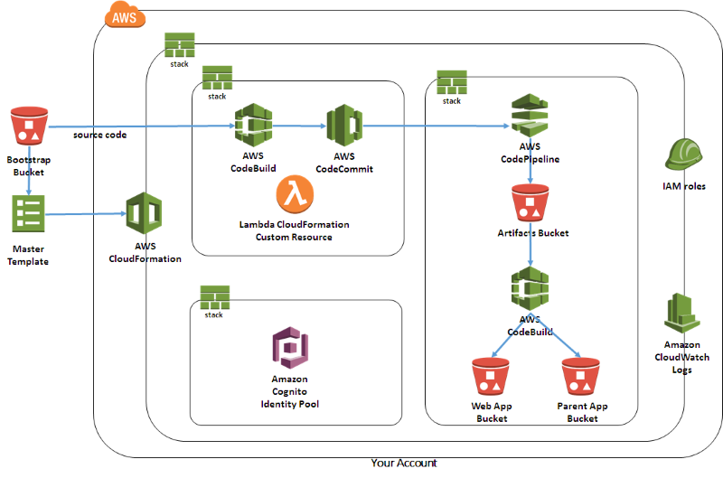
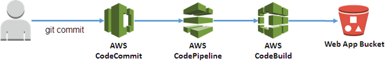

# CloudFormation Stack

> Sample CloudFormation Stack

## Overview
This directory provides a set of [AWS
CloudFormation](https://aws.amazon.com/cloudformation/) templates to
automatically build and deploy a demo site with the Lex web interface from
this project. The templates can be used to create and manage associated
resources such as the Lex Bot and Cognito Identity Pool.

By default, the web application is bootstrapped from source files
hosted in an AWS owned S3 bucket (see below for instructions on hosting
your own). Once deployed, the CloudFormation stack outputs links to
resources including the sample site and iframe embedding instructions.

### Deployment Modes
There are two master CloudFormation templates used for two different
deployment modes:

1. [CodeBuild Mode](#codebuild-deployment-mode) configures and deploys
directly to S3 from a CodeBuild project. It is deployed using he
[master.yaml](master.yaml) template.  This mode uses the pre-built
version of the chatbot UI library in the `dist` directory at the root
of this repository. By using the pre-built library, this makes this mode
faster and simpler to manage
2. [Pipeline Mode](#pipeline-deployment-mode) configures,
builds and deploys using a CI/CD pipeline (CodeCommit,
CodeBuild and CodePipeline). It is deployed using the
[master-pipeline.yaml](master-pipeline.yaml) template. This mode
creates an automated deployment pipeline that performs a full build of
the application from source. This mode provides finer customization and
the ability to automatically push your own changes by committing to your
code repository

### Regions
The lex-web-ui can be launched into regions other than us-east-1 where Lex, Polly, Cognito, Codebuild are supported. 
Note that a pre-staged bootstrap S3 bucket is available in us-east-1 (N. Virginia), eu-west-1 (Ireland), 
and ap-southeast-2 (Sydney). See the
[blog post](https://aws.amazon.com/blogs/machine-learning/deploy-a-web-ui-for-your-chatbot/) for these links in the Launch section. 
You can also build your own version and deploy to an S3 bucket you own in a region 
where you would like to run CloudFormation. Here are the easiest steps to accomplish this.

One required needed to build lex-web-ui version 0.14.13 and higher is python3. The release.sh
step below will fail until python3 becomes available. The build must now 
package the python requests module separately and python3 is required to 
install this module. Cloud9 environments based on Amazon Linux 
come with python3 support. 
 
* Launch the Cloud9 IDE
* In your Cloud9 workspace, clone the repository using git
* cd into the root folder, aws-lex-web-ui
* npm install
* cd lex-web-ui
* npm install
* cd ../build
* ./release.sh
* aws s3 mb s3://[your-lex-bootstrap-bucket-name] --region eu-west-1
* export BUCKET=[your-lex-bootstrap-bucket-name]
* ./upload-bootstrap.sh
 
Your bootstrap bucket now contains the necessary files which the CloudFormation template will utilize. When you
launch your bucket in the target region using the master.yaml, make sure to change the Bootstrap Bucket parameter to
"[your-lex-bootstrap-bucket-name]" and change the Bootstrap Prefix to be just "artifacts".

### Launch
To launch a stack using the CodeBuild Mode (faster and easier), click this button:

[](https://console.aws.amazon.com/cloudformation/home?region=us-east-1#/stacks/new?stackName=lex-web-ui&templateURL=https://s3.amazonaws.com/aws-bigdata-blog/artifacts/aws-lex-web-ui/artifacts/templates/master.yaml)

Click the following button to launch a stack using the Pipeline Mode:

[](https://console.aws.amazon.com/cloudformation/home?region=us-east-1#/stacks/new?stackName=lex-web-ui&templateURL=https://s3.amazonaws.com/aws-bigdata-blog/artifacts/aws-lex-web-ui/artifacts/templates/master-pipeline.yaml)

### CloudFormation Resources
The CloudFormation stack can create resources in your AWS account
including:
- [Amazon Lex](http://docs.aws.amazon.com/lex/latest/dg/what-is.html)
bot. You can optionally pass the bot name of an existing one to avoid
creating a new one.
- [Cognito Identity Pool](http://docs.aws.amazon.com/cognito/latest/developerguide/identity-pools.html)
used to pass temporary AWS credentials to the web app. You can optionally
pass the ID of an existing Cognito Identity Pool to avoid creating a
new one.
- [CodeBuild](https://aws.amazon.com/codebuild/) project to configure
and deploy to S3 when using the CodeBuild Deployment Mode. If using the
Pipeline Deployment Mode, a CodeBuild project is created to bootstrap
a CodeCommit repository whit the application source.
- [S3](https://aws.amazon.com/s3/) buckets to host the web application
and to store build artifacts.
- [Lambda](https://aws.amazon.com/lambda/) functions used as CloudFormation
[Custom Resources](http://docs.aws.amazon.com/AWSCloudFormation/latest/UserGuide/template-custom-resources.html)
to facilitate custom provisioning logic
- [CloudWatch Logs](http://docs.aws.amazon.com/AmazonCloudWatch/latest/logs/WhatIsCloudWatchLogs.html)
groups automatically created to log the output of the Lambda functions
- Associated [IAM roles](http://docs.aws.amazon.com/IAM/latest/UserGuide/id_roles.html)
for the stack resources

If using the Pipeline Deployment Mode, the stack also creates the
following resources:
- [CodeCommit](https://aws.amazon.com/codecommit/)
repository loaded with the source code in this project. This is only
created when using the pipeline deployment mode
- A continuous delivery pipeline using [CodePipeline](https://aws.amazon.com/codepipeline/)
and [CodeBuild](https://aws.amazon.com/codebuild/).
The pipeline automatically builds and deploys changes to the app committed
  to the CodeCommit repo

### CloudFormation Templates
The following table lists the CloudFormation templates used to create
the stacks:

| Template | Description |
| --- | --- |
| [master.yaml](./master.yaml) | This is the master template used to deploy the stack using the CodeBuild Mode |
| [master-pipeline.yaml](./master-pipeline.yaml) | This is the master template used to deploy the stack using the Pipeline Mode |
| [lexbot.yaml](./lexbot.yaml) | Lex bot and associated resources (i.e. intents and slot types). |
| [cognito.yaml](./cognito.yaml) | Cognito Identity Pool and IAM role for unauthenticated identity access. |
| [cognitouserpoolconfig.yaml](./cognitouserpoolconfig.yaml) | This template updates the cognito user pool with application client and domain configuration to enable login through either Cognito or other Identity Providers linked via federation. |
| [codebuild-deploy.yaml](./codebuild-deploy.yaml) | Uses CodeBuild to create a configuration and deploy it along the site to S3. Used in CodeBuild Mode |
| [coderepo.yaml](./coderepo.yaml) | CodeCommit repo dynamically initialized with the files in this repo using CodeBuild and a custom resource. Used in Pipeline Mode |
| [pipeline.yaml](./pipeline.yaml) | Continuous deployment pipeline of the Lex Web UI Application using CodePipeline and CodeBuild. The pipeline takes the source from CodeCommit, builds the Lex web UI application using CodeBuild and deploys the app to an S3 bucket. Used in Pipeline Mode |

### Parameters
When launching the stack, you will see a list of available parameters
and a brief explanation of each one. You can take the default values
of all the CloudFormation parameters when you want to quickly test the
sample application. If you are deploying your own bot and/or integrating
with an existing page, you may want to modify the following parameters:

- `BotName`: Name of pre-existing Lex bot. This is an optional parameter.
  If left empty, a sample bot will be created based on the
  [OrderFlowers](http://docs.aws.amazon.com/lex/latest/dg/gs-bp.html)
  bot in the Lex
  [Getting Started](http://docs.aws.amazon.com/lex/latest/dg/gs-console.html)
  documentation.
- `BotAlias`: Lex Bot Alias to use. This parameter defines the alias
  to be used by the Lex Web UI. It defaults to a value of '$LATEST'. You can set 
  this attribute to values which have been defined for the bot and are visible in the 
  Amazon Lex Console. Typical values might be 'PROD' or 'DEV'.
- `CognitoIdentityPoolId`: Id of an existing Cognito Identity Pool.
  This is an optional parameter. If left empty, a Cognito Identity Pool
  will be automatically created. The pool ID is used by the web ui to
  get AWS credentials for making calls to Lex and Polly.
- `ParentOrigin`: [Origin](https://developer.mozilla.org/en-US/docs/Web/Security/Same-origin_policy)
  of the parent window. Only needed if you wish to embed the web app
  into an existing site using an iframe. The origin is used to control
  which sites can communicate with the iframe
- `EnableCognitoLogin`: The ChatBot will provide an optional login menu item 
  which supports use of Cognito to log in users via the Cognito User Pool,
  through social media login, or other SAML or OpenID based Identity Providers.
- `ReInitSessionAttributesOnRestart`: Lex session attributes are reset on new interactions
with Lex if this parameter is set to true. 

**NOTE**: Some parameters should be unique per AWS region. The parameter
descriptions specify when that is the case.

#### Chatbot UI Configuration Parameters
When deploying using the [CodeBuild Mode](#codebuild-deployment-mode),
you can pass some of the most commonly changed chatbot UI configuration by
using CloudFormation parameters. This includes the following parameters:

- `WebAppConfBotInitialText`: First bot message displayed in the chatbot UI
- `WebAppConfBotInitialSpeech`: Message spoken by bot when the microphone
is first pressed in a conversation
- `WebAppConfToolbarTitle`: Title displayed in the chatbot UI toobar
- `WebAppConfHelp`: String message sent by help button,  If empty icon will not be displayed in chatbot UI toolbar 
- `WebAppConfNegativeFeedback`: String message sent by the user to signal a negative feedback response if empty icon will not be displayed
- `WebAppConfPositiveFeedback`: String message sent by the user to signal a positive feedback response if empty icon will not be displayed
- `EnableMarkdownSupport`: Enables support of Markdown formatting in the UI by 
bots that provide Markdown formatting in their esponses.
- `ShouldLoadIframeMinimized`: When set to true and using the lex-web-ui embedded
in an iframe, the ChatBot Iframe will be minimized when the page is loaded. 
- `ShowResponseCardTitle`: Lex and Alexa based bots may return ResponseCards. 
ResponseCards always include a title. If this parameter is set to true, this title
is rendered in the lex-web-ui. Optionally this can be set to false, and the 
title is not displayed. This is a global setting. 

### Output
Once the CloudFormation stack is successfully launched, the status of
all nested stacks will be in the `CREATE_COMPLETE` green status. At
this point, the master stack will reference the resources in the output
section.

**NOTE**: When deploying with the [Pipeline
Mode](#pipeline-deployment-mode), the web app links will be available
once the pipeline has completed deploying (this process can take a
while). See the `PipelineUrl` output link to monitor the deployment
process. Similarly, in [CodeBuild Mode](#codebuild-deployment-mode)
there may be a small delay before the links are available. In this mode,
you can monitor the build progress by browsing to the `CodeBuildUrl`
output variable.

Here is a list of the most relevant output variables:
- `WebAppUrl`: URL of the web app running on a full page
- `ParentPageUrl`: URL of the web app running in an iframe. This is an
optional output that is returned only when the stack creates the sample
site It is not returned if an existing origin is passed as a parameter
to the stack during creation
- `SnippetUrl`: URL of a simple page showing the config created by the
build process and a HTML snippet demonstrating how to load the chatbot
UI in an iframe based on the config
- `CognitoIdentityPoolId`: Pool ID of the Cognito Identity Pool created
by the stack. This is an optional output that is returned only when the
stack creates a Cognito Identity Pool. It is not returned if an existing
pool ID was passed as a parameter to the stack during creation.
- `BotName`: Name of the Lex bot created by the stack. This is an
optional output that is returned only when the stack creates the sample
Lex bot. It is not returned if an existing Bot was passed as a parameter
to the stack during creation

This output variable is specific to the CodeBuild Mode:
- `CodeBuildUrl`: Link to CodeBuild project in the AWS console. After the
stack is successfully launched, the build is automatically started. You
can click on this link to monitor the build progress

These output variables are specific to the Pipeline Mode:
- `PipelineUrl`: Link to CodePipeline in the AWS console. After the stack
is successfully launched, the pipeline automatically starts the build and
deployment process. You can click on this link to monitor the pipeline
- `CodeCommitRepoUrl`: When using the Pipeline Deployment Mode, this is
the CodeCommit repository URL. You can clone the repo using this link
and push changes to it to have the pipeline build and deploy the web app

## Build and Deployment Overview
The CloudFormation stack builds and deploys the application using
CodeBuild. Various CloudFormation parameters and resource names
are passed as environmental variables to CodeBuild. This includes
references to the S3 Buckets, Cognito Identity Pool and Lex Bot created
by CloudFormation. CodeBuild uses the [Makefile](../Makefile) in the root
directory of this repository control the build and deployment process.

## CodeBuild Deployment Mode
This is the deployment mode used by the [master.yaml](master.yaml) file.
In this mode, the stack creates a CodeBuild project that creates
the application configuration and deploys the files to S3.

Click the following CloudFormation button to launch your own copy of
the sample application stack in the us-east-1 (N. Virginia) AWS region:

[](https://console.aws.amazon.com/cloudformation/home?region=us-east-1#/stacks/new?stackName=lex-web-ui&templateURL=https://s3.amazonaws.com/aws-bigdata-blog/artifacts/aws-lex-web-ui/artifacts/templates/master.yaml)

Once the CloudFormation stack is successfully launched and the status
of all nested stacks is `CREATE_COMPLETE`, browse to the `CodeBuildUrl`
link in the output section of the stack. Monitor the build run to make
sure it is successful. After the CodeBuild run completes, you can browse
to the `ParentPageUrl` or `WebAppUrl` links in the CloudFormation output
to see the deployed chatbot UI.

Once deployed, you can go back to the CodeBuild project to change the
application configuration by modifying the environmental variables
passed by CodeBuild. You can start a new build in CodeBuild to
reconfigure and redeploy the application.

The CodeBuild project uses a zip file, passed in the `BootstrapBucket`
parameter, as its source (defaults to an AWS owned S3 bucket). That zip
file contains the source in this project and it is regularly updated. If
you want to use your own source, see the [Deploy Using My Own Bootstrap
S3 Bucket](#deploy-using-my-own-bootstrap-s3-bucket) section below.

## Pipeline Deployment Mode
When creating the stack with the
[master-pipeline.yaml](master-pipeline.yaml) template, the stack creates
a deployment pipeline using
[CodeCommit](https://aws.amazon.com/codecommit/)
[CodePipeline](https://aws.amazon.com/codepipeline/)
and [CodeBuild](https://aws.amazon.com/codebuild/)
which automatically builds and deploys changes to the app committed
to the CodeCommit repo.

### Diagram
Here is a diagram of the CloudFormation stack created by the pipeline deployment mode:



### Launching Using the Pipeline
To deploy a CloudFormation stack with a working demo of the application,
follow the steps below:

1. Click the following CloudFormation button to launch your own copy of
the sample application stack in the us-east-1 (N. Virginia) AWS region:
[](https://console.aws.amazon.com/cloudformation/home?region=us-east-1#/stacks/new?stackName=lex-web-ui&templateURL=https://s3.amazonaws.com/aws-bigdata-blog/artifacts/aws-lex-web-ui/artifacts/templates/master-pipeline.yaml)
2. You can accept the defaults in the CloudFormation Create Stack Wizard
up until the last step. At the last step, when prompted to create
the stack, select the checkmark that says: "I acknowledge that AWS
CloudFormation might create IAM resources with custom names". It takes
about 10 minutes for the CloudFormation stacks to got to `CREATE_COMPLETE`
status
3. Once the status of all the CloudFormation stacks
is `CREATE_COMPLETE`, click on the `PipelineUrl` link in the output
section of the master stack.  This will take you to the CodePipeline
console. You can monitor the progress of the deployment pipeline from
there. It takes about 10 minutes to build and deploy the application
4. Once the pipeline has deployed successfully, go back to the
output section of the master CloudFormation stack and click on the
`ParentPageUrl` link. You can also browse to the `WebAppUrl` link. Those
links will take you to the sample application running as an embedded
iframe or as a stand-alone web application respectively

### Deployment Pipeline
The source of this project is automatically forked into a CodeCommit
repository created by the CloudFormation stack. Any changes pushed to
the master branch of this forked repo will automatically kick off the
pipeline which runs a CodeBuild job to build and deploy a new version
of the web app. You will need to
[setup](http://docs.aws.amazon.com/codecommit/latest/userguide/setting-up.html)
CodeCommit to push changes to this repo. You can obtain the CodeCommit
git clone URL from the `CodeCommitRepoUrl` output variable of the
master stack.

Here is a diagram of the deployment pipeline:



## Directory Structure
The following files and directories are relevant to the CloudFormation setup:

```
 .
 |__ Makefile              # Makefile run by CodeBuild
 |__ build                 # contains utilities for uploading the project sources to S3
 |__ config                # config files used during the build
 |__ lex-web-ui            # sample Lex web ui application source
 |__ templates             # cloudformation templates and related lambda functions
    |__ custom-resources   # lambda functions used in cfn custom resources
```
# How do I ...?

## Use or deploy my own bot?
The `BotName` CloudFormation parameter can be used to point
the stack to an existing bot. In the application, you can also
change the configuration files or pass parameters to it (see the
[Configuration](/README.md#configuration) section of the main README
for details).

If you want to make changes to the sample
bot deployed by the stack, you can edit the
[bot-definition.json](./custom-resources/bot-definition.json)
file. This file is used by the
[lex-manager.py](./custom-resources/lex-manager.py) which is
run in Lambda by a CloudFormation Custom Resource in the bot stack
created by the
[lexbot.yaml](./lexbot.yaml) template.
The bot definition is in a JSON file that contains all the resources
associated with the bot including intents and slot types.

The lex-manager.py script can be also used as a stand-alone shell script.
It allows to export existing bots (including associated resources like
intents and slot types) into a JSON file. The same script can be
used to import a bot definition into an account or to recursively delete
a bot and associated resources. Here is the script usage:

```
$ python lex-manager.py  -h
usage: lex-manager.py [-h] [-i [file] | -e [botname] | -d botname]

Lex bot manager. Import, export or delete a Lex bot. Used to
import/export/delete Lex bots and associated resources (i.e. intents, slot
types).

optional arguments:
  -h, --help            show this help message and exit
  -i [file], --import [file]
                        Import bot definition from file into account. Defaults
                        to: bot-definition.json
  -e [botname], --export [botname]
                        Export bot definition as JSON to stdout Defaults to
                        reading the botname from the definition file: bot-
                        definition.json
  -d botname, --delete botname
                        Deletes the bot passed as argument and its associated
                        resources.
```

## Delete the CloudFormation stacks?
The resources created by this stack can be easily removed from your
account by deleting the master CloudFormation stack. The master stack
is the one that was first created using the "Launch Stack" button. By
deleting this stack, the rest of the sub-stacks and resources will be
deleted with the exception of the CloudWatch Logs groups created by the
stack (these are retained for troubleshooting purposes).

The S3 buckets created by the stacks are deleted by default. If you wish
to retain the data in these buckets, you should set the `CleanupBuckets`
parameter to `false` in the master stack.

## Deploy Using My Own Bootstrap S3 Bucket
By default, the CloudFormation stacks use pre-staged files from
an AWS owned S3 bucket. These files are dynamically downloaded by the
CodeBuild project created by the CloudFormation stack and copied to S3
buckets created in your account. Additionally, these files are used to
bootstrap the CodeCommit repo used as the CodePipeline source when using
the [Pipeline Deployment Mode](#pipeline-deployment-mode).

The bootstrap bucket name and prefix are controlled by the
`BootstrapBucket` and `BootstrapPrefix` parameters of the master
CloudFormation templates. If you want to use your own bootstrap S3
bucket, this project provides a `Makefile` under the `build` directory
to facilitate uploading the bootstrap artifacts. Follow these steps to
populate the S3 bucket:

1. Create your own S3 bucket (you might want to enable
[bucket
versioning](http://docs.aws.amazon.com/AmazonS3/latest/dev/Versioning.html)
on this bucket).
2. Modify the variables in the local build environment file:
[config/env.mk](../config/env.mk). These variables control the build
environment and web application deployment. In specific, you should
modify the following variables:
     - `BOOTSTRAP_BUCKET_PATH`: point it to your own bucket (step 1)
     and prefix merged together as the path to the artifacts
3. Upload the files to your S3 bucket using `make upload` from
the [build](../build) directory under the root of the repo. This
directory contains a `Makefile` that can be used to build the
artifacts and upload the files to your S3 bucket. It uses the [aws
cli](https://aws.amazon.com/cli/) to copy the files to S3
4. Deploy the stack by using the `master.yml` or `master-pipeline`
templates. Change the the `BootstrapBucket` and `BootstrapPrefix`
parameters to point to your own bucket and path
